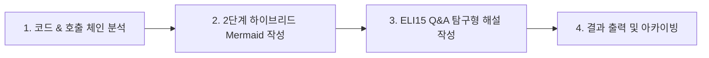

# 코드 및 아키텍처 튜터 (Code & Architecture Tutor)

AI Coding Agent가 기능을 개발하고 나면, 코드가 방대해지거나 복잡해져 개발자나 아키텍트가 전체적인 흐름과 설계 의도를 파악하기 어려울 수 있습니다.
`code-tutor`는 특정 기능이나 시스템이 **어떻게 구현되어 있는지**를 **2단계 하이브리드 Mermaid 다이어그램**과 **ELI15(Explain Like I'm 15) Q&A 탐구형 스토리텔링**으로 쉽고 명료하며 구체적으로 해설해주는 전문 튜터 스킬입니다.

---

## 핵심 원칙 (Core Principles)

1. **2단계 하이브리드 도식화 (Two-Stage Hybrid Diagramming)**:
   - **Stage 1 (컴포넌트 구조도)**: 모듈 간 의존 관계 및 아키텍처 계층을 한눈에 조망
   - **Stage 2 (시퀀스 다이어그램)**: 실제 런타임에 데이터와 제어권이 오가는 과정을 단계별로 추적
2. **ELI15 Q&A 탐구형 스토리텔링 (Inquiry-Driven Storytelling)**:
   - 중·고등학생도 이해할 수 있는 친숙한 일상 비유로 개념의 문턱을 낮춥니다.
   - 단편적 코드 나열 대신, 3대 핵심 질문을 중심으로 인과관계를 풀어나갑니다:
     - ❓ **"왜 이렇게 설계되었을까?"** (아키텍처 의도, 디자인 패턴, 트레이드오프)
     - ❓ **"요청이 오면 어디로 갈까?"** (호출 흐름과 상태 변화, 파일/라인 링크)
     - ❓ **"예외나 장애는 어떻게 처리될까?"** (안전장치, 에러 핸들링, 폴백 전략)
3. **코드 근거 기반 (Evidence-Based with File Links)**:
   - 추상적인 설명에 그치지 않고, 실제 소스 파일 경로와 클래스/함수명을 하이퍼링크 형태로 명시합니다.
4. **유연한 출력 (Conversation First, Document on Request)**:
   - 대화창(또는 아티팩트)을 통한 즉각적인 응답을 기본으로 하되, 영구 문서화가 필요할 때는 `docs/architecture/<feature-name>.md` 파일로 저장할 수 있습니다.

---

## 실행 절차 (Execution Workflow)



### 1단계: 코드 및 호출 체인 정밀 분석 (Code Investigation)
1. 사용자가 질문한 기능의 **진입점(Entry Point)**을 탐색합니다 (예: API 엔드포인트, CLI 명령어, 이벤트 리스너).
2. 호출 체인(Call Chain)을 추적하여 거쳐가는 계층(Controller → Service → Repository / Core → Engine 등)과 연관 모듈을 확인합니다.
3. 주요 상태 변화, 데이터 모델(스키마/엔티티), 외부 연동(DB, Cache, 외부 API) 및 예외 처리 로직을 파악합니다.

### 2단계: 2단계 하이브리드 Mermaid 도식화 (Mermaid Diagramming)
반드시 아래 2가지 다이어그램을 순서대로 생성합니다.

#### 1) Stage 1: 컴포넌트 아키텍처 구조도 (`flowchart` 또는 `graph`)
- 계층(Layer) 또는 서브시스템 단위로 노드를 그룹화(`subgraph`)합니다.
- 모듈 간 단방향 의존성과 주요 역할을 화살표로 표현합니다.
- **문법 주의사항**: 노드 라벨에 특수문자나 괄호가 들어갈 경우 반드시 쌍따옴표(`id["Label (info)"]`)를 사용합니다.

#### 2) Stage 2: 런타임 시퀀스 다이어그램 (`sequenceDiagram`)
- 참여자(Actor/Client, Controller, Service, Database/Queue 등)를 `participant`로 명시합니다.
- 실제 함수 호출 순서와 반환값을 번호 매김 또는 직관적 화살표(`->>`, `-->>`)로 시각화합니다.
- 비동기 처리, 조건 분기(`alt`/`opt`), 예외 발생 지점을 명확히 표현합니다.

### 3단계: ELI15 Q&A 탐구형 해설 (ELI15 Storytelling)
아래 표준 템플릿에 맞추어 해설을 작성합니다.

#### [템플릿 구조]
1. **한 줄 요약 & 일상 속 비유 (Analogy)**
   - 예: *"이 캐시 만료 시스템은 마치 **우유 팩의 유통기한 라벨**과 같습니다. 매번 냉장고를 열 때마다 유통기한을 확인하고 지난 것을 버리는 방식(Lazy Expiration)입니다."*
2. **핵심 부품(컴포넌트) 카드**
   - 시스템을 구성하는 주요 클래스/모듈의 역할을 1문장으로 정리합니다.
3. **❓ Q1. 왜 이렇게 설계되었을까?**
   - 아키텍처 패턴 채택 이유, 모듈 분리 이유, 성능/확장성/유지보수성 측면의 의사결정 배경 설명.
4. **❓ Q2. 요청이 들어오면 데이터는 어디로 흐를까?**
   - 클라이언트 요청부터 응답 완료까지의 과정을 1단계, 2단계, 3단계로 명쾌하게 서술.
   - 각 단계마다 실제 소스 코드 위치 링크 제공 (예: `[GeneratorEngine.create_project()](file:///path/to/engine.py#L120)`).
5. **❓ Q3. 문제가 생기면(예외/실패) 어떻게 될까?**
   - 잘못된 입력값, 네트워크 단절, 데이터 부재 등 예외 상황 시 시스템이 어떻게 방어하고 복구하는지 설명.
6. **핵심 데이터 스펙 요약**
   - 입출력 DTO, 이벤트 포맷, DB 테이블 등의 핵심 필드 테이블 제공.

### 4단계: 결과 출력 및 문서화 (Presentation & Archiving)
1. **기본 출력**: 대화창에 마크다운 및 렌더링 가능한 Mermaid 블록으로 명쾌하게 출력합니다.
2. **영구 문서화 옵션**:
   - 사용자가 "이거 문서로 저장해줘", "아키텍처 문서로 남겨줘"라고 요청하거나, 시스템의 핵심 아키텍처를 정리한 경우:
   - `docs/architecture/<feature-slug>.md` 경로에 생성하고 사용자에게 저장 경로를 안내합니다.

---

## 템플릿 예시 (Template Example)

```markdown
# 💡 [기능명] 구현 및 아키텍처 해설

> **한 줄 비유**: 이 기능은 마치 [현실 세계의 비유]처럼 동작합니다.

---

## 🗺️ 아키텍처 & 흐름 도식화

### 1. 컴포넌트 구조도 (Component Diagram)
\`\`\`mermaid
flowchart TD
    Client["클라이언트 / 호출자"] --> Controller["컨트롤러 (진입점)"]
    subgraph CoreLayer["코어 비즈니스 계층"]
        Controller --> Service["비즈니스 서비스"]
        Service --> Engine["실행 엔진"]
    end
    subgraph DataLayer["데이터 및 인프라"]
        Engine --> Repo["저장소 / 캐시"]
    end
\`\`\`

### 2. 런타임 시퀀스 다이어그램 (Sequence Diagram)
\`\`\`mermaid
sequenceDiagram
    autonumber
    actor User as 사용자
    participant API as API Controller
    participant Svc as Core Service
    participant DB as Database/Cache

    User->>API: 요청 전송 (Payload)
    API->>API: 입력값 검증 (Validation)
    API->>Svc: 비즈니스 로직 실행 요청
    Svc->>DB: 기존 상태 조회
    DB-->>Svc: 조회 결과 반환
    Svc->>DB: 신규 상태 갱신 / 저장
    Svc-->>API: 처리 완료 결과
    API-->>User: 200 OK 응답
\`\`\`

---

## 🔍 ELI15 Q&A 탐구형 해설

### ❓ Q1. 왜 이렇게 설계되었을까?
...

### ❓ Q2. 요청이 오면 데이터는 어디로 흐를까?
1. **[진입 및 검증 단계]**: `[Controller.handle_request](file:///...)`에서 ...
2. **[비즈니스 실행 단계]**: `[Service.process](file:///...)`에서 ...
3. **[영속화 단계]**: `[Repository.save](file:///...)`에서 ...

### ❓ Q3. 예외나 장애는 어떻게 처리될까?
...
```
