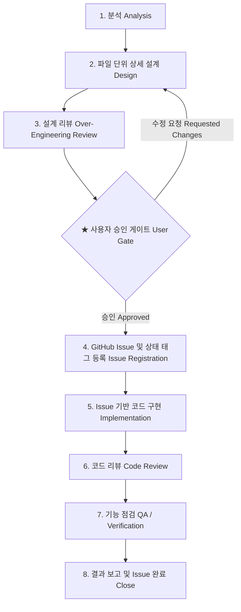

# AgentForge 개발 하네스 표준 워크플로우 명세 (Workflow Spec)

본 문서는 AgentForge 프로젝트 내에서 AI 코딩 에이전트가 `신규 기능(feature-development)`, `기능 개선(feature-enhancement)`, `버그 수정(bugfix)`을 수행할 때 반드시 준수해야 하는 **8단계 표준 개발 하네스 파이프라인**과 **태그(Label) 체계**, **오버엔지니어링 점검 기준**을 정의합니다.

---

## 1. 8단계 표준 워크플로우 파이프라인



### 단계별 상세 가이드

#### [1단계: 분석 (Analysis)]
- 요구사항의 핵심 목표, 도메인 규칙, 제약 사항을 파악합니다.
- 기존 코드베이스와의 의존성 및 데이터 계약(API Schema, DB Model 등)을 분석합니다.
- 변경으로 인한 파급 영향도(Impact Scope)를 사전 도출합니다.

#### [2단계: 파일 단위 상세 설계 (Design)]
- 설계 문서는 추상적인 개념 나열에 그치지 않고, **파일 단위로 구체적인 변경점**이 드러나야 합니다.
- 각 파일마다 아래 형식을 반드시 포함합니다:
  - `[NEW] path/to/new_file.py`: 신규 생성 파일 목적 및 주요 인터페이스/클래스/함수 시그니처
  - `[MODIFY] path/to/existing_file.py`: 수정 파일명 및 수정 대상 함수/라인 블록, 변경 로직
  - `[DELETE] path/to/deprecated_file.py`: 제거 파일 및 대체 방안
- DB 마이그레이션 필요 여부, 환경 변수 변경 여부, API 엔드포인트 변경 명세를 상세 기술합니다.

#### [3단계: 설계 리뷰 (Over-engineering Check)]
- 작성된 설계에 대해 아래 **오버엔지니어링 점검 체크리스트**를 기준으로 엄격하게 자체 검토합니다:
  1. **YAGNI (You Aren't Gonna Need It)**: "향후 필요할지도 모른다"는 이유로 작성된 미사용 기능, 확장 인터페이스, 파라미터가 있는가?
  2. **과도한 추상화(Premature Abstraction)**: 단 한 번만 구현되는 인터페이스/팩토리/어댑터/제네릭 클래스를 불필요하게 생성했는가?
  3. **클린 아키텍처 경계 왜곡**: 단순 CRUD나 유틸리티를 위해 불필요하게 도메인-유스케이스-레포지토리의 다중 계층을 무리하게 강제했는가?
  4. **최소 변경 원칙 (Minimal Diff)**: 기존 코드와 패턴을 재사용하여 변경 파일 수와 라인 수를 최소화했는가?
- 오버엔지니어링 요소가 발견되면 즉시 설계를 간소화하고, 리뷰 요약에 발견된 개선점(제거한 복잡도)을 기록합니다.

#### [★ 사용자 승인 게이트 (Human-in-the-loop Gate)]
- 에이전트는 설계를 임의로 확정하고 구현을 시작하지 않습니다.
- 설계서 및 오버엔지니어링 리뷰 결과를 사용자에게 제시하고 명시적 승인(`Proceed` 또는 확인 응답)을 받은 후 4단계로 진입합니다.

#### [4단계: GitHub Issue 및 태그 등록 (Issue Registration)]
- GitHub CLI(`gh`)를 통해 공식 Issue를 생성하고 해당 작업의 유형(`type:*`) 및 현재 단계(`stage:implementation`), 상태(`status:in-progress`) 태그를 부여합니다.
- **GitHub CLI 미설치 또는 미인증 시**:
  - 즉시 로컬 `.github/issues/ISSUE-<timestamp>-<slug>.md` (또는 `docs/issues/`) 경로에 마크다운 이슈 파일로 자동 저장(폴백)하고 사용자에게 수동 등록 링크 및 안내를 제공합니다.

#### [5단계: Issue 기반 구현 (Implementation)]
- 등록된 Issue 번호(또는 로컬 이슈 파일)를 기준으로 브랜치 또는 작업 컨텍스트를 유지하며 승인된 설계에 맞춰 정확히 코드를 구현합니다.
- 설계 범위를 벗어나는 임의의 추가 기능 구현은 금지됩니다.

#### [6단계: 코드 리뷰 (Code Review)]
- `git diff`를 통해 실제 변경 사항을 검토합니다:
  - 설계와의 일치 여부
  - 보안 취약점 (SQL Injection, 입력 검증 누락, 시크릿 하드코딩)
  - 불필요한 공백, 불필요한 주석, 임시 디버깅 코드 잔재
- GitHub Issue에 리뷰 요약 및 주요 체크포인트를 댓글(Comment)로 기록합니다.

#### [7단계: 기능 점검 (QA & Verification)]
- **자동화 테스트 실행**:
  - Backend: `pytest` (또는 `uv run pytest`)
  - Frontend: `npm test`, `npm run build`, `npm run lint`
- **신규/회귀 테스트 작성**:
  - 변경된 기능에 대한 새로운 단위/통합 테스트 케이스를 반드시 추가합니다.
  - 버그픽스인 경우, **버그를 재현하여 실패하는 테스트 케이스를 먼저 작성한 후 통과**시킵니다.
- **수동 검증 체크리스트 생성**:
  - API 호출 cURL 예제, Swagger UI 엔드포인트 확인 경로, 프론트엔드 브라우저 확인 절차를 정리합니다.

#### [8단계: 결과 보고 및 Issue 완료 (Close)]
- 전체 변경 내역, 테스트 결과, 남은 참고 사항을 포함한 최종 완료 보고서를 작성합니다.
- GitHub Issue 댓글에 최종 요약을 게시하고, 태그를 `stage:done`, `status:completed`로 전환 후 Issue를 Close합니다.

---

## 2. GitHub Issue & Tag (Label) 명세

### 태그 분류 체계

| 카테고리 | 태그명 (Label) | 색상 권장 | 설명 |
| :--- | :--- | :--- | :--- |
| **유형 (Type)** | `type:feature` | `#0E8A16` (Green) | 신규 기능 개발 |
| | `type:enhancement` | `#1D76DB` (Blue) | 기존 기능 개선 및 리팩토링 |
| | `type:bugfix` | `#D93F0B` (Red) | 결함 및 버그 수정 |
| **단계 (Stage)** | `stage:analysis` | `#FBCA04` (Yellow) | 요구사항/영향도 분석 중 |
| *(단일 유지)* | `stage:design` | `#FBCA04` (Yellow) | 파일 단위 상세 설계 중 |
| | `stage:design-review` | `#FEF2C0` (Light Yellow) | 오버엔지니어링 검토 및 승인 대기 |
| | `stage:implementation` | `#5319E7` (Purple) | 코드 구현 진행 중 |
| | `stage:code-review` | `#006B75` (Teal) | 코드 리뷰 및 정밀 점검 중 |
| | `stage:qa-testing` | `#BFDADC` (Cyan) | 자동화/수동 기능 점검 중 |
| | `stage:done` | `#0E8A16` (Green) | 검증 완료 및 작업 종료 |
| **상태 (Status)** | `status:in-progress` | `#C2E0C6` (Light Green) | 작업 진행 중 |
| | `status:blocked` | `#B60205` (Dark Red) | 사용자 피드백 대기 또는 차단 |
| | `status:completed` | `#0E8A16` (Green) | 성공적으로 완료됨 |

### 단계 전이(Transition) 규칙
- `stage:*` 태그는 작업 진행에 따라 이전 stage 태그를 제거하고 현재 stage 태그 하나만 유지합니다.
- 예: 4단계 진입 시 `stage:design-review` 제거 → `stage:implementation` 추가.
- 7단계 통과 후 8단계 진입 시 `stage:implementation` / `stage:qa-testing` 제거 → `stage:done` 및 `status:completed` 부여.

---

## 3. GitHub CLI (`gh`) 연동 및 로컬 폴백 명령

### 1) GitHub CLI 설치 및 인증 확인
```bash
gh auth status
```

### 2) 라벨 사전 생성 (최초 1회 또는 누락 시)
```bash
gh label create "type:feature" --color "0E8A16" --description "New feature development" --force
gh label create "type:enhancement" --color "1D76DB" --description "Feature enhancement & refactoring" --force
gh label create "type:bugfix" --color "D93F0B" --description "Bug fix" --force
gh label create "stage:design-review" --color "FEF2C0" --description "Design review & approval gate" --force
gh label create "stage:implementation" --color "5319E7" --description "Under implementation" --force
gh label create "stage:code-review" --color "006B75" --description "Under code review" --force
gh label create "stage:qa-testing" --color "BFDADC" --description "QA verification" --force
gh label create "stage:done" --color "0E8A16" --description "Completed stage" --force
gh label create "status:in-progress" --color "C2E0C6" --description "Work in progress" --force
gh label create "status:completed" --color "0E8A16" --description "Successfully completed" --force
```

### 3) Issue 생성
```bash
gh issue create --title "[Feature] 기능 명칭" \
  --label "type:feature,stage:implementation,status:in-progress" \
  --body-file "docs/issues/draft-design.md"
```

### 4) 태그 전이 (Transition) 및 댓글 추가
```bash
# 단계 변경 (예: implementation -> qa-testing)
gh issue edit <ISSUE_NUM> --remove-label "stage:implementation" --add-label "stage:qa-testing"

# 진행 상황 댓글 게시
gh issue comment <ISSUE_NUM> --body "### 기능 점검 결과
- Pytest 통과: 42 passed
- 신규 테스트 케이스 3건 추가 완료"
```

### 5) Issue 완료 (Close)
```bash
gh issue edit <ISSUE_NUM> --remove-label "stage:qa-testing" --add-label "stage:done,status:completed"
gh issue close <ISSUE_NUM> --comment "모든 구현, 리뷰 및 기능 점검이 완료되어 이슈를 종료합니다."
```

### 6) 로컬 폴백 포맷 (GitHub 미연동 시)
GitHub CLI 사용이 불가한 경우 프로젝트 내 `.github/issues/` 디렉토리에 아래 마크다운 파일로 영구 보관합니다:
- 경로: `.github/issues/ISSUE-<YYYYMMDD>-<slug>.md`
- 파일 헤더에 메타데이터(Type, Stage, Status, Assignee, CreatedAt)를 YAML Frontmatter로 명시합니다.
