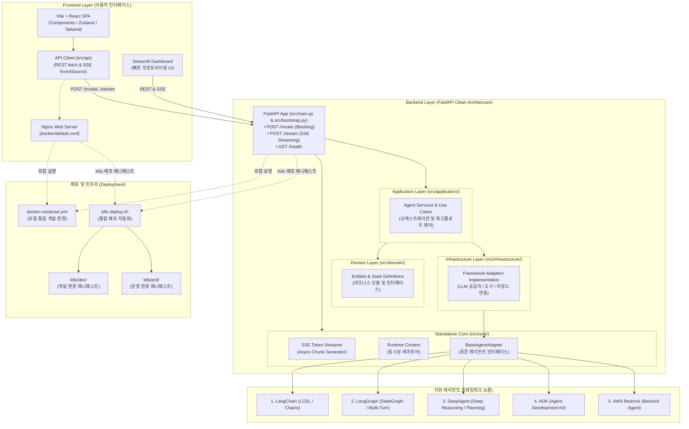

<div align="center">
  

  # AgentForge ⚡

  > **Fast, Standalone & Production-Ready AI Agent Framework**  
  > 빠른 AI 에이전트 개발을 위해 프론트엔드, 백엔드, Kubernetes 배포까지 풀스택 독립형 아키텍처를 자동 생성하는 오픈소스 프레임워크입니다.

  [](https://www.python.org/)
  [](LICENSE)
  [](#-생성되는-프로젝트-구조-user-project-layout)
  [](#-지원-에이전트-프레임워크-5종)
</div>

---

## 🌟 개요 (Overview)

**AgentForge**는 기존 [FastLangFrame](https://github.com/bulgemi/FastLangFrame)의 설계 철학을 계승하고, 실제 현업 및 프로덕션 환경에서의 한계점을 혁신적으로 개선한 차세대 AI 에이전트 스캐폴딩 & 런타임 프레임워크입니다.

### 💡 FastLangFrame 대비 무엇이 달라졌나요?

| 구분 | 기존 FastLangFrame | ✨ **AgentForge** |
| :--- | :--- | :--- |
| **프로젝트 생성 위치** | 프레임워크 내부 `projects/` 고정 | **사용자가 원하는 로컬 임의 경로(`--path`) 자유 지정** |
| **코어 코드 의존성** | 중앙 코어 모듈을 참조(`import`)하는 종속형 구조 | **Core 엔진을 생성 프로젝트에 복사하여 100% 독립 실행(Standalone)** |
| **에이전트 프레임워크** | LangChain / LangGraph 중심 | **LangChain, LangGraph, DeepAgent, ADK, AWS Bedrock 5종 전폭 지원** |
| **인프라 의존성 (Bloat)** | Authelia, Nginx, Redis, DB 등 기본 탑재 (무거움) | **초경량 최소화 (Zero Bloat): 불필요한 외부 의존성 제거, 즉시 실행** |
| **스택 범위** | 백엔드 API + 일부 테스트 UI 위주 | **Frontend (React+Vite / Streamlit) + Backend (FastAPI) + K8s 매니페스트 풀스택 생성** |
| **템플릿 시스템** | 레거시 복잡 템플릿 | **현대적 코드베이스 기반 신규 클린 템플릿 전면 재작성** |
| **CLI 생태계** | 저장소 스크립트(`bin/lapm`) 실행 방식 | **독립 설치형 글로벌 CLI (`agentforge`, `af`) 풀 라이프사이클 지원** |

---

## 🏗️ 아키텍처 (Architecture)

AgentForge로 생성된 프로젝트는 [pay](https://github.com/Seorin25F/pay) 저장소의 검증된 실전 아키텍처를 계승하여 **풀스택 모노레포(Clean Architecture)** 형태로 구성되며, 각 티어가 느슨하게 결합되어 독립적으로 실행·배포될 수 있습니다.



---

## 🤖 지원 에이전트 프레임워크 5종

AgentForge는 백엔드 표준 어댑터(`BaseAgentAdapter`) 패턴을 내장하여, 어떤 프레임워크를 선택하더라도 클라이언트와 표준화된 규격으로 통신합니다.

| 프레임워크 | 설명 | 특징 및 추천 활용처 | 공식 링크 |
| :--- | :--- | :--- | :--- |
| **1. LangChain** | 엔드투엔드 LLM 체인 구성의 표준 | 전통적인 프롬프트 체이닝, 간단한 Tool Calling 에이전트 | [공식 문서](https://www.langchain.com/) |
| **2. LangGraph** | 순환형(Cyclic) 그래프 및 분기 상태 제어 | 정교한 Multi-Turn 대화, Human-in-the-loop, 다중 에이전트 제어 | [공식 문서](https://www.langchain.com/langgraph) |
| **3. DeepAgent** | 심층 추론(Deep Reasoning) 및 계획 수립 에이전트 | 단계별 사고 과정(Thinking), 연구 및 복합 문제 분석 특화 | [공식 문서](https://docs.langchain.com/oss/python/deepagents/overview) |
| **4. ADK (Agent Development Kit)** | 모듈식 경량 에이전트 개발 키트 | 표준 도구 및 컴포넌트 조합형 엔지니어링 에이전트 | [공식 문서](https://adk.dev/) |
| **5. AWS Bedrock** | AWS 네이티브 완전관리형 AI 에이전트 | 엔터프라이즈 AWS 보안/규정 준수, Bedrock Agents 및 Knowledge Base 연동 | [공식 문서](https://aws.amazon.com/ko/bedrock/) |

> 📌 **표준 API 보장**: 모든 프레임워크 어댑터는 동일한 엔드포인트를 제공합니다.
> - `POST /invoke` : 단일 프롬프트 동기 블로킹 호출
> - `POST /stream` : 실시간 토큰 및 이벤트 스트리밍 (Server-Sent Events, SSE)
> - `GET /health` : 서비스 상태 및 에이전트 로딩 헬스체크

---

## 🔐 기본 제공 엔터프라이즈 기능 (Enterprise Features)

AgentForge로 생성되는 모든 프로젝트는 [pay](https://github.com/Seorin25F/pay) 저장소에서 검증된 엔터프라이즈급 인증, 데이터베이스, 관리자 거버넌스 체계를 기본 탑재합니다.

| 분류 | 세부 기능 | 구현 기술 및 특징 |
| :--- | :--- | :--- |
| **다중 인증 (Multi-Auth)** | **ID/Password** | PBKDF2/Bcrypt/Argon2 솔팅 해싱 및 비밀번호 복잡도/잠금 정책 |
| | **사내 LDAP** | `ldap3` 기반 Active Directory / OpenLDAP 연동 및 계정 자동 프로비저닝 |
| | **SAML 2.0 SSO** | `pysaml2` 기반 Service Provider(SP) 메타데이터 교환 및 ACS Assertion 검증 |
| **세션 & 보안 (Security)** | **토큰 & 분산 세션** | Native JWT Access/Refresh 토큰 및 Redis 분산 세션 저장소 |
| | **토큰 취소 (Blacklist)** | 로그아웃 및 세션 만료 시 즉시 토큰 무효화 (`auth:blacklist:{jti}`) |
| | **Rate Limiting** | 무차별 대입(Brute-Force) 공격 방지 슬라이딩 윈도우 요청 제한 |
| **데이터베이스 (Database)** | **PostgreSQL 16** | `SQLModel` + `SQLAlchemy 2.0 Async` 기반 비동기 연결 풀 관리 |
| | **자동 마이그레이션** | `Alembic` 비동기 스크립트 기반 DB 스키마 버전 관리 |
| | **페이징 헬퍼** | `Page`, `PageableParams` 표준 페이징 및 정렬 규격 제공 |
| **프론트엔드 (Frontend)** | **사용자 채팅 포털** | SSE 실시간 스트리밍 대화창, 사고과정(Thinking) 터미널 콘솔, Human-in-the-loop 승인 카드 |
| | **관리자 콘솔 포털** | 사용자 목록 조회(페이징/검색/필터), 신규 등록, 계정 잠금 해제, 임시 비밀번호 발급 |
| | **멀티 엔트리포인트** | 1개 Vite 프로젝트에서 `/index.html`(사용자)과 `/admin.html`(관리자) 독립 번들링 서빙 |

---

## 🏛️ AgentForge 프레임워크 저장소 구조

AgentForge 프레임워크 자체의 코드베이스는 표준 Python 패키지 레이아웃을 따르며, CLI 도구, 프로젝트 스캐폴딩 엔진, 모듈형 템플릿, 그리고 생성 프로젝트로 복사될 표준 Core 엔진 원본으로 구성됩니다.

```text
AgentForge/
├── agentforge/                    # 핵심 Python 패키지 (CLI & 생성기 엔진)
│   ├── cli/                       # CLI 도구 구현체 (Typer 기반)
│   │   ├── commands/              # 세부 하위 명령어
│   │   │   ├── new.py             # `agentforge new` (프로젝트 생성)
│   │   │   ├── dev.py             # `agentforge dev` (로컬 동시 실행)
│   │   │   ├── build.py           # `agentforge build` (Docker 빌드)
│   │   │   └── deploy.py          # `agentforge deploy` (K8s 배포)
│   │   └── main.py                # CLI 진입점 & 인터랙티브 TUI 마법사
│   │
│   ├── generator/                 # 프로젝트 스캐폴딩 및 템플릿 합성 엔진
│   │   ├── copier.py              # Core 엔진 코드 복사 & 파일 주입 모듈
│   │   ├── engine.py              # Jinja2 템플릿 렌더링 및 모듈 조합기
│   │   └── validator.py           # 사용자 입력 파라미터 및 경로 검증기
│   │
│   ├── core/                      # 생성 프로젝트(backend/src/core/)로 복사될 독립 런타임 원본
│   │   ├── adapter.py             # 표준 BaseAgentAdapter 인터페이스 & AgentChunk 규격
│   │   ├── config.py              # Pydantic Settings 환경 설정 베이스
│   │   ├── database.py            # SQLModel/SQLAlchemy 커넥터 & 페이징 헬퍼
│   │   ├── logging.py             # 구조화 JSON 로깅 엔진
│   │   └── streaming.py           # 실시간 SSE 스트리머 & 동시성 세마포어
│   │
│   └── templates/                 # 모듈 조합형 프로젝트 템플릿 저장소
│       ├── backend/               # FastAPI 백엔드 (Clean Architecture)
│       │   ├── src/
│       │   │   ├── domain/        # User, AuthSession, Chat 엔티티 & 포트
│       │   │   ├── application/   # Auth, UserManagement, Chat 서비스 & DTO
│       │   │   ├── infrastructure/# SQLModel, Native JWT, LDAP3, PySAML2, Redis, REST 라우터
│       │   │   ├── frameworks/    # 5대 프레임워크별 어댑터/에이전트 템플릿
│       │   │   ├── bootstrap.py   # Lifespan 및 앱 조립 Composition Root
│       │   │   └── main.py        # 백엔드 웹 서버 진입점
│       │   ├── alembic/           # 데이터베이스 마이그레이션 버전 관리
│       │   ├── alembic.ini
│       │   ├── pyproject.toml     # uv 기반 의존성 정의
│       │   └── Dockerfile         # 멀티스테이지 컨테이너 빌드
│       │
│       ├── frontend/              # 프론트엔드 모듈 템플릿
│       │   └── react-vite/        # Vite + React 멀티 엔트리포인트 (사용자 채팅 + 관리자 포털)
│       │       ├── src/
│       │       │   ├── auth/      # AuthProvider, LoginForm (ID/PW, LDAP, SAML)
│       │       │   ├── components/# ChatAssistant, TerminalConsole, InterruptApprovalCard
│       │       │   ├── admin/     # AdminApp, AccountManagementPanel
│       │       │   ├── App.jsx    # 사용자 채팅 포털 엔트리
│       │       │   └── main.jsx
│       │       ├── index.html     # 사용자 채팅 포털 HTML
│       │       ├── admin.html     # 관리자 콘솔 포털 HTML
│       │       ├── vite.config.js # 멀티 엔트리 번들러 설정
│       │       ├── tailwind.config.js
│       │       └── package.json
│       │
│       ├── infra/                 # 로컬 통합 인프라 템플릿
│       │   ├── docker-compose.yml # PostgreSQL 16 + Redis 7 + Backend + Frontend
│       │   └── postgres-init/     # DB 초기화 스크립트
│       │
│       └── k8s/                   # Kubernetes 실전 배포 매니페스트 템플릿
│           ├── dev/               # 개발 환경 (Deployment, Service, ConfigMap)
│           ├── prd/               # 운영 환경 (HA, 리소스 제한, Ingress)
│           └── k8s-deploy.sh      # 원클릭 배포 자동화 스크립트
│
├── tests/                         # 프레임워크 자체 테스트 스위트
│   ├── test_core.py               # Core 런타임 단위 테스트 (36 passed)
│   ├── test_generator.py          # 프로젝트 생성 및 Core 복사 무결성 검증 (5 passed)
│   ├── test_cli.py                # CLI 명령어 단위 테스트 (4 passed)
│   └── e2e/                       # 4-Tier E2E 통합 테스트 스위트 (98 passed)
│
├── pyproject.toml                 # 패키지 빌드 메타데이터 및 CLI 스크립트 엔트리포인트 (`agentforge`, `af`)
├── LICENSE                        # MIT License
└── README.md
```

---

## 📁 생성되는 프로젝트 구조 (User Project Layout)

`agentforge new` 명령으로 생성된 프로젝트는 [pay](https://github.com/Seorin25F/pay) 저장소의 실전 Clean Architecture 모노레포 구조를 기반으로 하며, 외부 프레임워크 저장소에 전혀 의존하지 않는 완전한 독립형(Standalone) 프로젝트입니다.

```text
my-awesome-agent/
├── backend/                       # FastAPI 기반 백엔드 (Clean Architecture 계층 구조)
│   ├── src/                       # 백엔드 핵심 소스
│   │   ├── core/                  # 복사된 독립형 Standalone Core 엔진
│   │   │   ├── adapter.py         # 표준 BaseAgentAdapter 인터페이스
│   │   │   ├── config.py          # Pydantic Settings 환경 설정
│   │   │   ├── database.py        # SQLModel/SQLAlchemy 커넥터 & 세션/페이징
│   │   │   ├── logging.py         # 구조화 로깅
│   │   │   └── streaming.py       # 실시간 SSE 스트리머 & 동시성 세마포어
│   │   ├── domain/                # 사용자(User), 세션(AuthSession), 대화(Chat) 엔티티 및 포트
│   │   ├── application/           # 인증 서비스, 사용자 관리 서비스, 대화 서비스 및 DTO
│   │   ├── infrastructure/        # SQLModel 테이블, Native JWT, LDAP3, PySAML2, Redis, REST 라우터
│   │   ├── main.py                # FastAPI 웹 애플리케이션 진입점
│   │   └── bootstrap.py           # Core + Auth 중첩 Lifespan 및 앱 조립 Root
│   ├── alembic/                   # 데이터베이스 마이그레이션 버전 관리
│   ├── alembic.ini
│   ├── Dockerfile                 # 백엔드 프로덕션 멀티스테이지 Dockerfile
│   └── pyproject.toml             # uv / pyproject 기반 의존성 정의
│
├── frontend/                      # Vite + React 멀티 엔트리포인트 포털
│   ├── src/
│   │   ├── api/                   # 백엔드 통신 API 클라이언트
│   │   ├── auth/                  # AuthProvider, LoginForm(ID/PW, LDAP, SAML), useAuth
│   │   ├── components/
│   │   │   ├── chat/              # ChatAssistant, TerminalConsole, InterruptApprovalCard
│   │   │   └── settings/          # AccountManagementPanel (사용자 CRUD, 잠금해제, 비밀번호 초기화)
│   │   ├── admin/                 # AdminApp, useAdminRoute (관리자 전용 콘솔)
│   │   ├── App.jsx                # 사용자 채팅 포털 메인 앱
│   │   └── main.jsx
│   ├── index.html                 # 사용자 포털 엔트리 (/index.html)
│   ├── admin.html                 # 관리자 포털 엔트리 (/admin.html)
│   ├── docker/                    # Nginx 웹서버 설정 및 경량 배포 Dockerfile
│   ├── package.json
│   ├── vite.config.js             # Vite 멀티 엔트리 번들러 설정
│   └── tailwind.config.js         # Tailwind CSS 스타일링 설정
│
├── k8s/                           # 환경 분리형 Kubernetes 실전 배포 매니페스트
│   ├── dev/                       # 개발(Dev) 환경 매니페스트 (Backend, Frontend, ConfigMap)
│   ├── prd/                       # 운영(Prod) 환경 매니페스트 (HA 고가용성 & 리소스 튜닝)
│   └── k8s-deploy.sh              # 환경별 원클릭 클러스터 배포 쉘 스크립트
│
├── docker-compose.yml             # 로컬 통합 개발 환경 원클릭 실행 (Postgres 16 + Redis 7 + Backend + Frontend)
├── postgres-init/                 # PostgreSQL 초기화 스크립트
└── README.md                      # 프로젝트 전용 안내 문서
```

---

## 🚀 빠른 시작 (Quick Start)

### 1. AgentForge CLI 설치

```bash
# pip를 통한 설치
pip install agentforge

# 또는 uv / pipx를 통한 초고속 설치
uv tool install agentforge
```

### 2. 새 프로젝트 생성 (`agentforge new`)

원하는 위치에 프로젝트 이름, 사용할 에이전트 프레임워크, 프론트엔드 유형을 지정하여 생성합니다.

```bash
# 기본 사용법
agentforge new <프로젝트명> --framework <프레임워크> --frontend <프론트엔드> --path <경로>

# 예시 1: LangGraph + React(Vite) 조합으로 현재 디렉토리에 생성
agentforge new customer-agent --framework langgraph --frontend react --path .

# 예시 2: AWS Bedrock + Streamlit 조합으로 특정 디렉토리에 생성
agentforge new enterprise-bot --framework bedrock --frontend streamlit --path /data/projects

# 대화형 모드 (옵션을 지정하지 않으면 인터랙티브 마법사 실행)
agentforge init
```

#### 옵션 플래그 상세

| 옵션 | 단축형 | 설명 | 선택값 |
| :--- | :--- | :--- | :--- |
| `--framework` | `-f` | 에이전트 개발 프레임워크 | `langchain`, `langgraph`, `deepagent`, `adk`, `bedrock` |
| `--frontend` | `-ui` | 프론트엔드 인터페이스 | `react` (Vite + Tailwind), `streamlit`, `none` (headless 백엔드) |
| `--path` | `-p` | 프로젝트가 생성될 디렉토리 경로 | 기본값: 현재 작업 디렉토리 (`.`) |

---

## 💻 CLI 도구 명령어 (`agentforge` / `af`)

AgentForge CLI는 프로젝트 스캐폴딩부터 로컬 테스트, 빌드, 배포까지 전 주기(Full Lifecycle)를 지원합니다.

### 1) 로컬 개발 서버 실행 (`dev`)
백엔드(FastAPI)와 프론트엔드(Vite React / Streamlit)를 한 번에 실행합니다.
```bash
cd <프로젝트디렉토리>
agentforge dev
# Backend: http://localhost:8000 (API Docs: http://localhost:8000/docs)
# Frontend: http://localhost:5173 (React/Vite) 또는 http://localhost:8501 (Streamlit)
```

### 2) Docker 이미지 빌드 (`build`)
배포를 위한 프로덕션 컨테이너 이미지를 빌드합니다.
```bash
agentforge build --tag v1.0.0
# backend:v1.0.0 및 frontend:v1.0.0 이미지 생성
```

### 3) Kubernetes 클러스터 배포 (`deploy`)
`k8s/` 매니페스트를 타겟 클러스터에 배포합니다.
```bash
agentforge deploy --namespace ai-agents
```

---

## 🛠️ 개발 및 기여 가이드 (Contributing)

AgentForge는 오픈소스 프로젝트로서 커뮤니티의 기여를 적극 환영합니다.

```bash
# 1. 저장소 클론
git clone https://github.com/bulgemi/AgentForge.git
cd AgentForge

# 2. 개발 환경 설정
poetry install  # 또는 pip install -e ".[dev]"

# 3. 테스트 실행
pytest
```

새로운 에이전트 프레임워크 어댑터 추가, 프론트엔드 템플릿 개선, K8s 매니페스트 최적화 등 다양한 기여를 기다립니다. 이슈와 PR을 편하게 남겨주세요!

---

## 📄 라이선스 (License)

이 프로젝트는 [MIT License](LICENSE)에 따라 배포됩니다.
