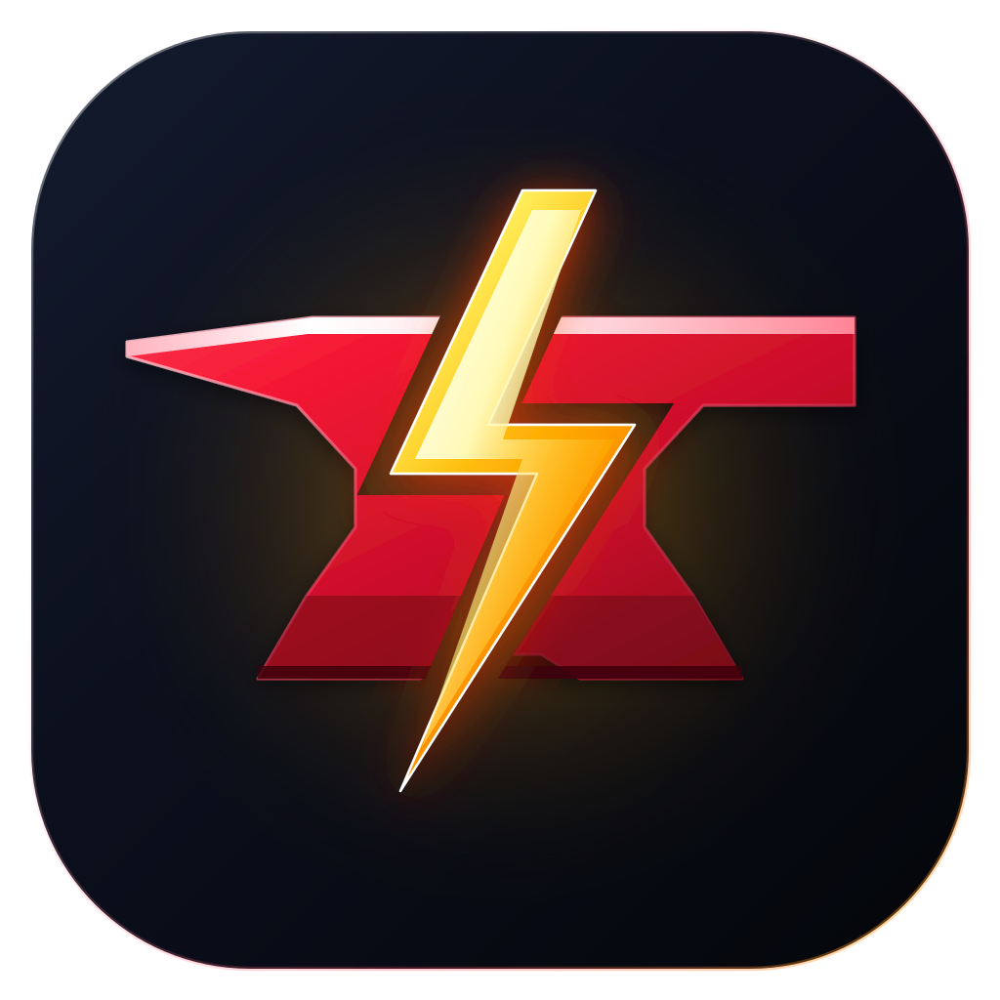
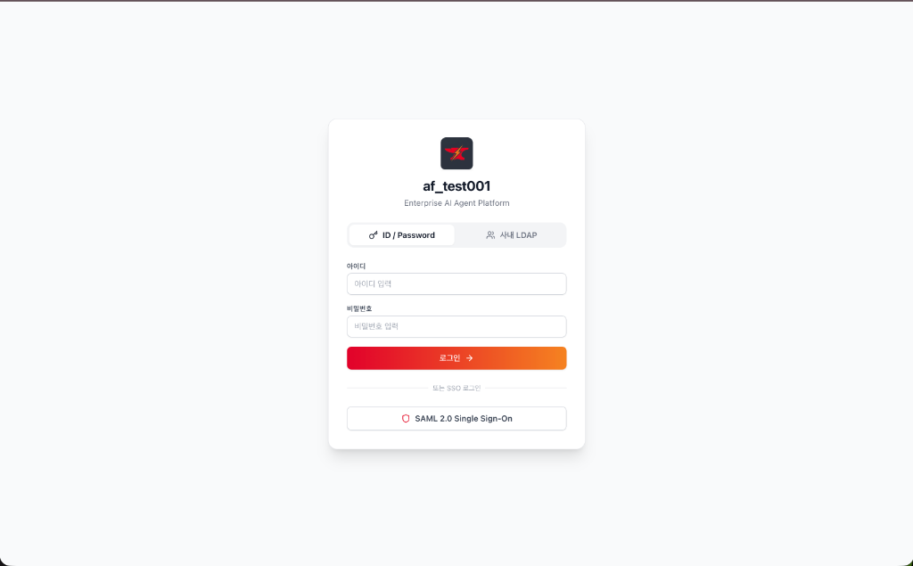
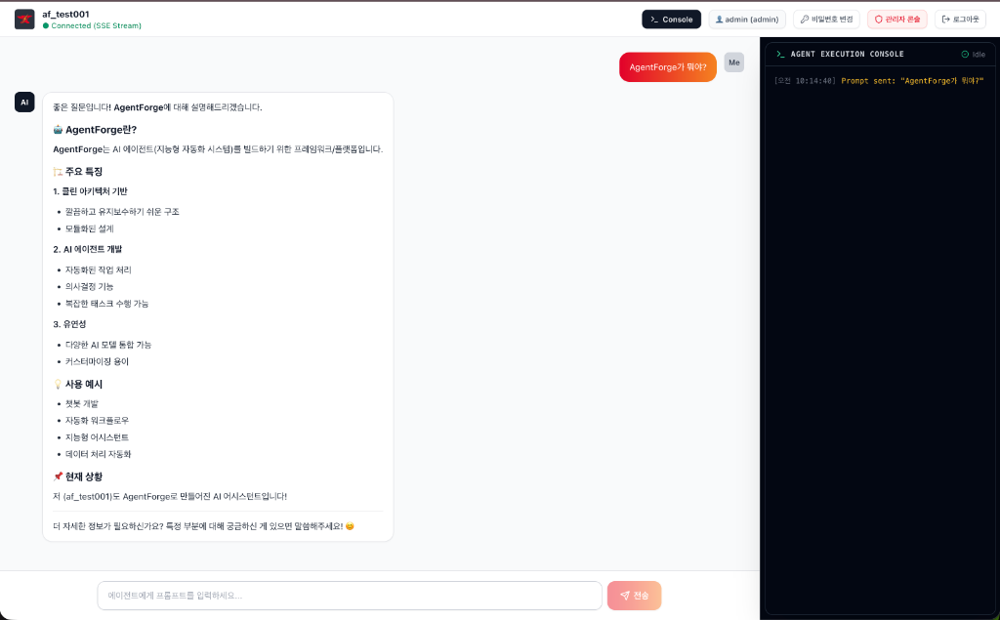
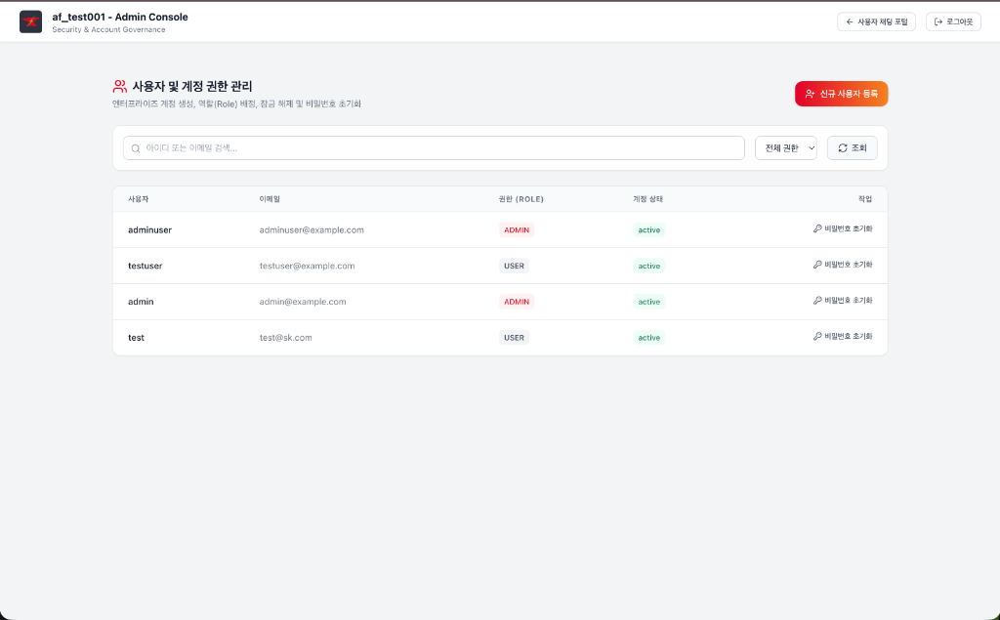
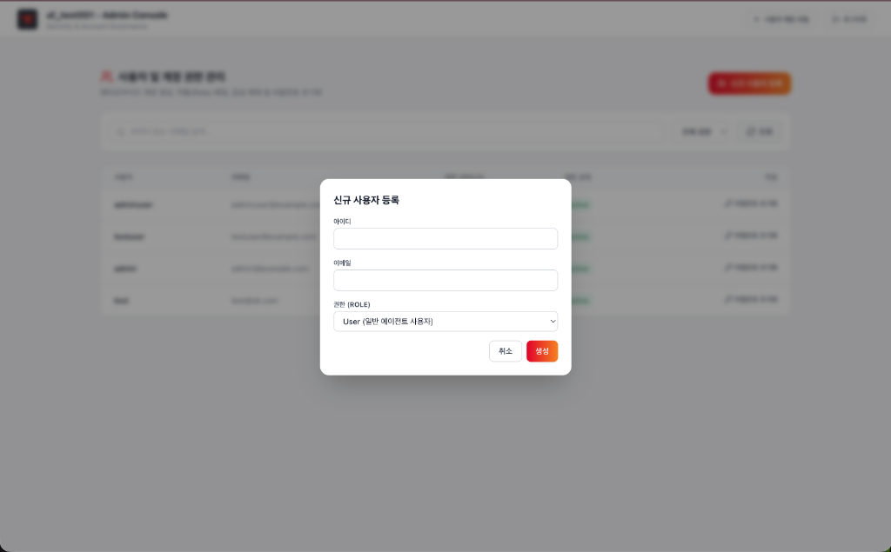
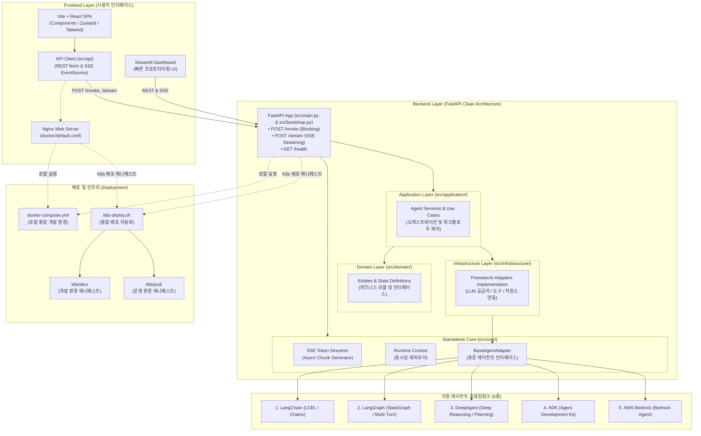

<div align="center">
  

  # AgentForge ⚡

  > **Fast, Standalone & Production-Ready AI Agent Framework**  
  > 빠른 AI 에이전트 개발을 위해 프론트엔드, 백엔드, Kubernetes 배포까지 풀스택 독립형 아키텍처를 자동 생성하는 오픈소스 프레임워크입니다.

  [](https://www.python.org/)
  [](LICENSE)
  [-blueviolet.svg)](#-스펙-기반-ui-개발--ai-coding-agent-협업-체계-frontenddesignmd)
  [](#--생성되는-프로젝트-구조-user-project-layout)
  [](#--지원-에이전트-프레임워크-5종)
  [](docs/quickstart.md)
  [](docs/quickstart.md#4단계-생성-프로젝트-화면-및-주요-기능-둘러보기-ui-walkthrough)
</div>

> 🚀 **빠른 시작 가이드**: 프로젝트 생성부터 환경 설정, 원클릭 기동 및 실제 웹 UI 둘러보기까지 한 번에 안내하는 [**⚡ 3분 사용자 가이드 (docs/quickstart.md)**](docs/quickstart.md)를 확인하세요!

---

### ⚡ 10초 퀵 스타트 (Quick Start)

```bash
# 1. AgentForge CLI 도구 설치 (uv 또는 pip)
uv tool install agentforge     # 또는 pip install agentforge

# 2. 독립형 풀스택 에이전트 프로젝트 생성 (원하는 프레임워크 선택)
af new my-agent --framework langgraph --frontend react

# 3. 생성된 디렉토리로 이동 후 원클릭 실행 (로컬 인프라 & 앱 동시 기동)
cd my-agent && ./run.sh        # Windows: run.bat
```
> 🌐 **기동 후 브라우저 접속**: [http://localhost:5173](http://localhost:5173) (기본 관리자 로그인: `admin` / `admin1234!`)

---

## 📑 목차 (Table of Contents)

1. [🌟 개요 (Overview)](#-개요-overview)
   - [✨ 왜 AgentForge인가요? (핵심 차별화 강점)](#-왜-agentforge인가요-핵심-차별화-강점)
2. [🖥️ 생성 프로젝트 UI 화면 둘러보기 (Application UI Screens)](#️-생성-프로젝트-ui-화면-둘러보기-application-ui-screens)
   - [🎨 스펙 기반 UI 개발 & AI Coding Agent 협업 체계 (`frontend/DESIGN.md`)](#-스펙-기반-ui-개발--ai-coding-agent-협업-체계-frontenddesignmd)
3. [🤖 지원 에이전트 프레임워크 5종](#-지원-에이전트-프레임워크-5종)
4. [⚙️ 스캐폴딩 생성기(Scaffolding Generator) 설치 및 사용 가이드](#️-스캐폴딩-생성기scaffolding-generator-설치-및-사용-가이드)
   - [1. 설치 방법 (Installation)](#1-설치-방법-installation)
   - [2. CLI 스캐폴딩 사용법 (`af new`)](#2-cli-스캐폴딩-사용법-agentforge-new--af-new)
   - [3. Python 프로그래밍 API (`ScaffoldingEngine`)](#3-python-프로그래밍-api-사용법-scaffoldingengine)
   - [4. 5단계 합성 메커니즘](#4-스캐폴딩-엔진의-5단계-합성-메커니즘)
5. [🌱 환경 변수 관리 (.env & .env.sample)](#-환경-변수-관리-env--envsample)
   - [1. 백엔드 환경 변수](#1-백엔드-환경-변수-backendenv--backendenvsample)
   - [2. 프론트엔드 환경 변수](#2-프론트엔드-환경-변수-frontendenv--frontendenvsample)
   - [3. 보안 거버넌스 및 자동화 연동](#3-보안-거버넌스-및-자동화-연동)
6. [💻 CLI 도구 명령어 (`agentforge` / `af`)](#-cli-도구-명령어-agentforge--af)
   - [1) 로컬 개발 서버 실행 (`dev`)](#1-로컬-개발-서버-실행-dev-또는-원클릭-스크립트)
   - [2) Docker 이미지 빌드 (`build`)](#2-docker-이미지-빌드-build)
   - [3) Kubernetes 클러스터 배포 (`deploy`)](#3-kubernetes-클러스터-배포-deploy)
7. [🏗️ 아키텍처 (Architecture)](#️-아키텍처-architecture)
8. [🔐 기본 제공 엔터프라이즈 기능 (Enterprise Features)](#-기본-제공-엔터프라이즈-기능-enterprise-features)
9. [🐳 로컬 인프라 및 Docker Compose 가이드 (Local Infrastructure & Profiles)](#-로컬-인프라-및-docker-compose-가이드-local-infrastructure--profiles)
   - [1. 서비스 스택 및 프로파일 구성](#1-서비스-스택-및-프로파일-구성-compose-profiles)
   - [2. 프로파일별 실행 명령어](#2-프로파일별-실행-및-관리-명령어)
   - [3. 주요 대시보드 엔드포인트 및 기본 계정](#3-주요-서비스-웹-대시보드-및-엔드포인트-url)
   - [4. 원클릭 런처 자동 연동](#4-로컬-원클릭-런처-자동-연동-runsh--runbat)
10. [📁 생성되는 프로젝트 구조 (User Project Layout)](#-생성되는-프로젝트-구조-user-project-layout)
    - [🏛️ AgentForge 프레임워크 자체 저장소 구조](#️-agentforge-프레임워크-자체-저장소-구조-내부-엔진)
11. [📦 사용 Python 패키지 및 버전 정보 (Dependencies)](#-사용-python-패키지-및-버전-정보-dependencies)
12. [🛠️ 개발 및 기여 가이드 (Contributing)](#️-개발-및-기여-가이드-contributing)
13. [📄 라이선스 (License)](#-라이선스-license)

---

## 🌟 개요 (Overview)

**AgentForge**는 실제 현업 및 엔터프라이즈 프로덕션 환경에 즉시 투입 가능한 AI 에이전트 서비스를 수 초 만에 생성하고 실행하는 차세대 **풀스택 에이전트 스캐폴딩 & 런타임 프레임워크**입니다.

복잡한 백엔드 아키텍처, 실시간 토큰 스트리밍 UI, 멀티 인증(ID/PW, LDAP, SAML), 분산 세션(Redis), PostgreSQL DB 마이그레이션, 그리고 Kubernetes 배포 매니페스트까지 엔터프라이즈 필수 구성 요소를 **단 하나의 명령어로 100% 독립 실행(Standalone) 가능한 프로젝트**로 합성합니다.

### ✨ 왜 AgentForge인가요? (핵심 차별화 강점)

기존 레거시 프레임워크([FastLangFrame](https://github.com/bulgemi/FastLangFrame))의 한계점을 극복하고, 현업의 요구사항을 반영하여 전면 재설계되었습니다:

| 구분 | 기존 레거시 프레임워크 | ✨ **AgentForge** | 사용자가 얻는 혜택 |
| :--- | :--- | :--- | :--- |
| **프로젝트 생성 위치** | 프레임워크 내부 `projects/` 고정 | **사용자 로컬 임의 경로(`--path`) 자유 지정** | 기존 작업 공간이나 기업 사내 레포에 자유롭게 생성 |
| **코어 코드 의존성** | 중앙 코어를 참조(`import`)하는 종속형 | **Core 엔진을 100% 독립 복사(Standalone)** | 프레임워크 외부 설치 없이 독립 레포로 버전 관리 및 배포 가능 |
| **에이전트 프레임워크** | LangChain / LangGraph 중심 | **LangChain, LangGraph, DeepAgent, ADK, Bedrock 5종 지원** | 비즈니스 목적에 맞게 최적의 에이전트 기술 스택 선택 |
| **인프라 의존성 (Bloat)** | Authelia, Nginx, Redis 등 무조건 탑재 (무거움) | **초경량 최소화 (Zero Bloat) & 프로파일 선택 구동** | 불필요한 리소스 낭비 없이 즉시 가볍게 실행 |
| **스택 범위** | 백엔드 API + 일부 테스트 UI 위주 | **Frontend (React/Streamlit) + FastAPI + K8s 풀스택** | 프론트엔드부터 클라우드 배포까지 올인원 일괄 자동 완성 |
| **템플릿 시스템** | 레거시 복잡 템플릿 | **Clean Architecture 기반 현대적 클린 템플릿** | 유지보수가 쉽고 도메인 계층이 분리된 엔터프라이즈 표준 코드 |
| **CLI 생태계** | 저장소 스크립트(`bin/lapm`) 실행 | **독립 설치형 글로벌 CLI (`agentforge`, `af`) 풀 라이프사이클** | 터미널 어디서나 단 한 줄로 생성, 실행, 빌드, 배포 제어 |

---

## 🖥️ 생성 프로젝트 UI 화면 둘러보기 (Application UI Screens)

AgentForge로 생성된 프로젝트는 추가 프론트엔드 작업 없이 즉시 실전에 투입 가능한 **반응형 사용자 AI 채팅 포털(`/index.html`)**과 **엔터프라이즈 계정 거버넌스 관리자 콘솔(`/admin.html`)**을 기본 제공합니다.

> 📖 **화면별 상세 기능 안내**:  
> 각 화면의 세부 동작 및 시나리오는 [**⚡ 3분 사용자 가이드 (docs/quickstart.md)**](docs/quickstart.md#4단계-생성-프로젝트-화면-및-주요-기능-둘러보기-ui-walkthrough)에서 자세히 확인하실 수 있습니다.

| 1. 통합 로그인 포털 (Multi-Auth & SAML SSO) | 2. AI 에이전트 대화 & 실시간 실행 콘솔 |
| :---: | :---: |
| [](docs/quickstart.md#4-1-엔터프라이즈-통합-로그인-포털-enterprise-multi-auth-login) | [](docs/quickstart.md#4-2-ai-에이전트-채팅-포털--실시간-실행-콘솔-agent-chat--live-execution-console) |
| [**상세 설명 보기 →**](docs/quickstart.md#4-1-엔터프라이즈-통합-로그인-포털-enterprise-multi-auth-login) | [**상세 설명 보기 →**](docs/quickstart.md#4-2-ai-에이전트-채팅-포털--실시간-실행-콘솔-agent-chat--live-execution-console) |
| **3. 관리자 콘솔 (계정 및 권한 거버넌스)** | **4. 신규 사용자 등록 모달 (프로비저닝)** |
| [](docs/quickstart.md#4-3-관리자-콘솔---사용자-및-권한-관리-admin-console-security--account-governance) | [](docs/quickstart.md#4-4-관리자-콘솔---신규-사용자-등록-모달-new-user-registration-modal) |
| [**상세 설명 보기 →**](docs/quickstart.md#4-3-관리자-콘솔---사용자-및-권한-관리-admin-console-security--account-governance) | [**상세 설명 보기 →**](docs/quickstart.md#4-4-관리자-콘솔---신규-사용자-등록-모달-new-user-registration-modal) |

👉 **[⚡ 3분 사용자 가이드 (프로젝트 생성부터 화면 둘러보기까지) 전체 보기 →](docs/quickstart.md)**

---

### 🎨 스펙 기반 UI 개발 & AI Coding Agent 협업 체계 (`frontend/DESIGN.md`)

AgentForge는 **"프로젝트 고유의 요구사항에 맞추어 UI 명세를 정의하고, 이를 바탕으로 AI 코딩 에이전트가 오차 없이 맞춤형 UI를 개발하도록 지원"**하는 **스펙 기반 UI 개발(Spec-Driven UI Development)** 방법론을 기본 제공합니다.

프로젝트를 생성하면 프론트엔드 루트 디렉토리에 표준 설계 명세서인 [**`frontend/DESIGN.md`**](agentforge/templates/frontend/react-vite/DESIGN.md) 템플릿이 자동으로 배치됩니다.  
개발자는 자신의 프로젝트 요건(도메인 특성, 브랜드 테마, 화면 레이아웃, 커스텀 컴포넌트)에 맞게 `DESIGN.md`를 작성하고, **Cursor, Claude Code, GitHub Copilot, Windsurf, Antigravity** 등 AI 코딩 에이전트에게 이 문서를 기준으로 개발을 지시함으로써 **스타일 파편화나 환각 없이 프로젝트 요구사항에 정확히 부합하는 일관된 UI/UX를 신속하게 구현**할 수 있습니다.

```
 ┌────────────────────────┐      ┌────────────────────────┐      ┌────────────────────────┐
 │   1단계: 스펙 정의     │ ───> │ 2단계: AI 에이전트 지시 │ ───> │ 3단계: 일관된 UI 생성  │
 │  프로젝트 요건에 맞게   │      │ Cursor / Claude Code에 │      │  스펙을 100% 준수한     │
 │   DESIGN.md 작성/수정  │      │  DESIGN.md 기준 지시   │      │   맞춤형 프론트엔드    │
 └────────────────────────┘      └────────────────────────┘      └────────────────────────┘
```

#### 🔄 3단계 스펙 기반 UI 개발 워크플로우

1. **1단계: 프로젝트 요건 정의 (`frontend/DESIGN.md` 작성 및 커스터마이징)**
   - 프로젝트 생성 후 `frontend/DESIGN.md`를 열어 비즈니스 도메인과 고유 요구사항에 맞게 스펙을 편집합니다.
   - **브랜드 & 컬러 팔레트**: 프로젝트의 메인/서브 브랜드 색상 및 시맨틱 상태 컬러 정의 (기본 제공되는 SK Red/Orange는 즉시 실행 가능한 프로덕션 베이스라인 예시입니다).
   - **화면 및 컴포넌트 스펙**: 대상 사용자 경험에 필요한 카드, 모달, 폼, 데이터 테이블 등의 세부 규격 기술.
   - **에이전트 인터랙션 요건**: 실시간 토큰 스트리밍, Human-in-the-Loop(HITL) 도구 승인, 실행 로그 콘솔 등 프로젝트에 필요한 인터랙션 규칙 명시.

2. **2단계: AI 에이전트 지시 (Single Source of Truth 연동)**
   - AI 코딩 도구(Cursor, Windsurf, Claude Code 등)에게 신규 컴포넌트나 페이지 개발을 요청할 때 `frontend/DESIGN.md`를 단일 진실 공급원(SSOT)으로 지정합니다.
   - **프롬프트 예시**:
     > *"Follow the project requirements and UI specifications in `frontend/DESIGN.md`. Implement the new user profile dashboard adhering strictly to our defined color tokens, 8pt spacing, Lucide icons, and component standards."*
   - 프로젝트의 `.cursorrules` 또는 프롬프트 지침에 `DESIGN.md` 준수 규칙을 등록하여 모든 작업에 자동 적용할 수도 있습니다.

3. **3단계: 일관된 UI 생성 및 지속적 유지보수 (Consistent Generation & Maintenance)**
   - AI 에이전트는 `DESIGN.md`에 명시된 엄격한 제약 규칙(임의의 hex 클래스 금지, 단일 아이콘 패밀리 준수, 인라인 스타일 금지 등)을 준수하여 프로젝트 요건에 완벽히 부합하는 코드를 작성합니다.
   - 향후 새로운 화면 추가나 리팩토링 시에도 `DESIGN.md`가 기준점이 되므로, 여러 작업자나 서로 다른 AI 도구를 교차 활용하더라도 전체 프로젝트의 UI/UX 일관성이 영구적으로 유지됩니다.

#### 📋 기본 제공 검증 베이스라인 (Baseline Starter Specification)
템플릿에 기본 포함된 `DESIGN.md`는 프로젝트 즉시 가동을 위한 **프로덕션 레퍼런스 베이스라인**을 담고 있으며, 프로젝트 요구사항에 따라 완전히 재정의할 수 있습니다:
- **디자인 토큰**: Tailwind 컬러 팔레트, 8pt 그리드 여백 배수 (`p-2`, `p-4`, `p-6`), 통일된 라운딩 (`rounded-xl`, `rounded-2xl`)
- **아이콘 체계**: 단일 아이콘 패밀리 원칙 ([`lucide-react`](https://lucide.dev/))
- **AI 인터랙션 패턴**: 실시간 SSE 스트리밍 버블, HITL 승인 카드(`InterruptApprovalCard`), 코드 구문 강조(`MarkdownContent`), 다크 콘솔 드로어(`TerminalConsole`)
- **품질 제약 (Do's & Don'ts)**: 임의의 hex 컬러(`bg-[#...]`) 및 인라인 `style={{}}` 방지, 접근성 시맨틱 태그 준수

---

## 🤖 지원 에이전트 프레임워크 5종

AgentForge는 백엔드 표준 어댑터(`BaseAgentAdapter`) 패턴을 내장하여, 어떤 프레임워크를 선택하더라도 클라이언트와 표준화된 규격으로 통신합니다.

| 프레임워크 | 설명 | 특징 및 추천 활용처 | 공식 링크 |
| :--- | :--- | :--- | :--- |
| **1. LangChain** | 엔드투엔드 LLM 체인 구성의 표준 | 전통적인 프롬프트 체이닝, 간단한 Tool Calling 에이전트 | [공식 문서](https://www.langchain.com/) |
| **2. LangGraph** | 순환형(Cyclic) 그래프 및 분기 상태 제어 | 정교한 Multi-Turn 대화, Human-in-the-loop, 다중 에이전트 제어 | [공식 문서](https://www.langchain.com/langgraph) |
| **3. DeepAgent** | 심층 추론(Deep Reasoning) 및 계획 수립 에이전트 | 단계별 사고 과정(Thinking), 연구 및 복합 문제 분석 특화 | [공식 문서](https://docs.langchain.com/oss/python/deepagents/overview) |
| **4. ADK (Agent Development Kit)** | 모듈식 경량 에이전트 개발 키트 | 표준 도구 및 컴포넌트 조합형 엔지니어링 에이전트 | [공식 문서](https://adk.dev/) |
| **5. AWS Bedrock** | AWS 네이티브 완전관리형 AI 에이전트 | 엔터프라이즈 AWS 보안/규정 준수, Bedrock Agents 및 Knowledge Base 연동 | [공식 문서](https://aws.amazon.com/ko/bedrock/) |

> 📌 **표준 API 보장**: 모든 프레임워크 어댑터는 동일한 엔드포인트를 제공합니다.
> - `POST /invoke` : 단일 프롬프트 동기 블로킹 호출
> - `POST /stream` : 실시간 토큰 및 이벤트 스트리밍 (Server-Sent Events, SSE)
> - `GET /health` : 서비스 상태 및 에이전트 로딩 헬스체크

---

## ⚙️ 스캐폴딩 생성기(Scaffolding Generator) 설치 및 사용 가이드

AgentForge Scaffolding Generator는 완전한 독립형(Standalone) 프로덕션 AI 에이전트 프로젝트를 수 초 만에 자동 합성하는 핵심 도구입니다. **글로벌 CLI (`agentforge`, `af`)** 및 **Python 프로그래밍 API (`ScaffoldingEngine`)**를 모두 제공합니다.

---

### 1. 설치 방법 (Installation)

#### 방법 A. PyPI / uv를 통한 전역 CLI 설치 (가장 권장)
```bash
# uv를 통한 초고속 격리 설치 (권장)
uv tool install agentforge

# 또는 pip / pipx를 통한 전역 설치
pip install agentforge
# pipx install agentforge
```

#### 방법 B. 원클릭 자동 설치 스크립트 (저장소 소스 클론 시)
저장소를 클론한 후 OS에 맞는 원클릭 설치 스크립트를 실행하면 가상환경 구성, 패키지 설치, CLI 등록까지 전 과정을 자동으로 완료합니다.
```bash
git clone https://github.com/bulgemi/AgentForge.git
cd AgentForge

# macOS / Linux
./install.sh

# Windows
install.bat
```
- 시스템의 Python 3.12+ 및 `uv` 설치 여부를 자동 감지합니다.
- `uv`가 있으면 초고속 설치를 진행하며, 없을 시 표준 `python venv/pip`로 안전하게 폴백합니다.

#### 방법 C. 수동 소스 클론 및 개발자 모드 설치
```bash
git clone https://github.com/bulgemi/AgentForge.git
cd AgentForge

# 편집 가능(editable) 모드 설치
pip install -e .
# 또는 uv 환경에서 개발 의존성 포함 설치: uv pip install -e ".[dev]"
```

> 💡 **단축 명령어 지원**: 설치가 완료되면 `agentforge`와 동일한 기능의 단축 명령어인 `af`를 자유롭게 사용할 수 있습니다.
> ```bash
> af --help
> ```

---

### 2. CLI 스캐폴딩 사용법 (`agentforge new` / `af new`)

터미널에서 명령어 한 줄로 원하는 에이전트 프레임워크와 프론트엔드 인터페이스 조합의 독립형 프로젝트를 생성합니다.

```bash
# 기본 구문
agentforge new <프로젝트명> [OPTIONS]
# 또는 단축형
af new <프로젝트명> [OPTIONS]
```

#### 📌 옵션 플래그 상세

| 옵션 | 단축형 | 기본값 | 설명 | 선택 가능한 값 |
| :--- | :--- | :--- | :--- | :--- |
| `--framework` | `-f` | `langgraph` | 에이전트 개발 프레임워크 | `langgraph`, `langchain`, `deepagent`, `adk`, `bedrock` |
| `--frontend` | `-ui` | `react` | 프론트엔드 사용자 인터페이스 | `react` (Vite SPA), `streamlit`, `none` (Headless 백엔드만 생성) |
| `--path` | `-p` | `.` (현재 폴더) | 프로젝트가 생성될 상위 디렉토리 경로 | 임의의 로컬 디렉토리 경로 |
| `--force` | | `False` | 동일 이름 디렉토리 존재 시 덮어쓰기 | 플래그 지정 시 활성화 |

#### 🚀 실전 스캐폴딩 명령어 예시

```bash
# 예시 1: LangGraph + React 풀스택 모노레포 생성 (가장 권장되는 기본 조합)
af new customer-agent --framework langgraph --frontend react --path .

# 예시 2: AWS Bedrock + Streamlit 대시보드 조합으로 특정 디렉토리에 생성
af new enterprise-bot -f bedrock -ui streamlit -p /data/projects

# 예시 3: DeepAgent 심층추론 에이전트 + Headless API 백엔드만 생성 (프론트엔드 제외)
af new reasoner-api -f deepagent -ui none

# 예시 4: 기존 폴더가 있어도 강제로 덮어쓰며 재생성 (--force)
af new demo-bot -f langchain -ui react --force
```

---

### 3. Python 프로그래밍 API 사용법 (`ScaffoldingEngine`)

Python 스크립트나 CI/CD 파이프라인 내부에서 프로그래밍 방식으로 프로젝트를 자동 생성할 수 있습니다.

```python
from pathlib import Path
from agentforge.generator.engine import ScaffoldingEngine

# 1. 스캐폴딩 엔진 초기화
engine = ScaffoldingEngine()

# 2. 프로젝트 자동 생성 실행
project_path = engine.generate(
    project_name="finance-ai-agent",
    target_dir="./workspace",
    framework="langgraph",      # langchain | langgraph | deepagent | adk | bedrock
    frontend="react",           # react | streamlit | none
    force=True,                 # 기존 대상 디렉토리 덮어쓰기 허용 여부
)

print(f"✓ 프로젝트 생성 완료: {project_path}")
```

---

### 4. 스캐폴딩 엔진의 5단계 합성 메커니즘

AgentForge 스캐폴딩 엔진은 단순 파일 복사가 아닌, 프로덕션 배포가 가능한 완전 무결한 상태의 프로젝트를 단계별로 조립합니다.

1. **파라미터 및 대상 경로 유효성 검증 (`validator.py`)**: 프로젝트명 규칙, 프레임워크 지원 여부, 디렉토리 쓰기 권한 검증.
2. **Clean Architecture 템플릿 합성 (`engine.py`)**: 백엔드 계층 구조(Domain, Application, Infrastructure), 프론트엔드 멀티 엔트리포인트, Docker Compose 및 K8s 매니페스트 렌더링.
3. **브랜딩 및 정적 자산 자동 배포**: 공식 파비콘(`favicon.ico`)과 로고(`agentforge_icon.png`)를 생성 프로젝트의 `frontend/public/`으로 복제하고 UI 자동 연결.
4. **Standalone Core 엔진 독립 복제 (`copier.py`)**: 프레임워크 중앙 저장소에 의존하지 않도록 `agentforge/core/` 런타임 코드를 `backend/src/core/`로 100% 독립 복사.
5. **AST 구문 무결성 검증 (`validator.py`)**: 생성된 모든 Python 파일의 문법 컴파일(`compileall`)을 수행하고 맞춤형 안내 문서 자동 생성.

---

## 🌱 환경 변수 관리 (.env & .env.sample)

AgentForge로 생성되는 모든 프로젝트는 **Backend**와 **Frontend** 각각에 `.env`와 `.env.sample`을 기본 제공하며, 스캐폴딩 시 로컬 `.env`가 기본값으로 자동 치환 생성됩니다.

### 1. 백엔드 환경 변수 (`backend/.env` & `backend/.env.sample`)

백엔드는 `pydantic-settings`의 [`BaseAppSettings`](agentforge/core/config.py) 및 `AuthConfig`를 통해 환경 변수를 자동 로딩합니다.

| 카테고리 | 주요 환경 변수 | 기본값 (스캐폴딩 시) | 설명 |
| :--- | :--- | :--- | :--- |
| **프로젝트 기본** | `PROJECT_NAME` | `{{ project_name }}` | 애플리케이션 및 서비스 식별자 |
| | `ENVIRONMENT` | `dev` | 런타임 환경 (`dev`, `prd`, `test`) |
| | `HOST` / `PORT` | `0.0.0.0` / `8000` | 서버 바인딩 호스트 및 포트 |
| **LLM 공급자** | `LLM_PROVIDER` | `openai` (또는 지정 fw) | 기본 공급자 (`openai`, `gemini`, `anthropic`, `bedrock`) |
| | `OPENAI_API_KEY` / `OPENAI_MODEL_NAME` | `gpt-4o` | OpenAI API 키 및 모델명 |
| | `GOOGLE_API_KEY` / `GEMINI_MODEL_NAME` | `gemini-2.5-pro` | Google Gemini API 키 및 모델명 |
| | `ANTHROPIC_API_KEY` / `CLAUDE_MODEL_NAME` | `claude-3-5-sonnet-20240620` | Anthropic Claude API 키 및 모델명 |
| | `BEDROCK_MODEL_ID` / `AWS_REGION` | `ap-northeast-2` | AWS Bedrock 추론 모델 ID 및 리전 |
| **데이터베이스** | `DATABASE_URL` | `postgresql+asyncpg://...` | 전체 DB 접속 URL |
| | `DATABASE_DBNAME` | `{{ project_name_snake }}` | 데이터베이스명 |
| | `DATABASE_AUTO_MIGRATE` | `true` | 기동 시 스키마 자동 초기화 및 마이그레이션 적용 여부 |
| **캐시 & 세션** | `REDIS_URL` | `redis://localhost:6379/0` | 분산 세션 및 토큰 블랙리스트 Redis URL |
| **보안 & 인증** | `JWT_SECRET_KEY` | `{{ project_name }}-secret-key-...` | 토큰 서명용 시크릿 키 (운영 시 32자 이상 필수) |
| | `JWT_ALGORITHM` | `HS256` | JWT 서명 알고리즘 |
| | `DEFAULT_ADMIN_PASSWORD` | `admin1234!` | 최초 기동 시 자동 시딩될 기본 관리자(`admin`) 계정 비밀번호 |
| | `CORS_ORIGINS` | `["http://localhost:5173", ...]` | 허용 CORS 오리진 목록 |
| | `LDAP_ENABLED` / `SAML_ENABLED` | `false` | 사내 계정 연동 및 SAML SSO 활성화 토글 |
| **MCP 도구** | `AX_MCP_SERVER_URL` / `AX_MCP_SERVER_NAME` | `http://127.0.0.1:8080/mcp` | Model Context Protocol 도구 서버 연동 |
| **LLM 관측성 (Langfuse)** | `LANGFUSE_ENABLED` / `LANGFUSE_BASE_URL` | `true` / `http://localhost:3000` | Langfuse v3 LLM 추적 및 관측성 활성화 토글 |
| | `LANGFUSE_NEXTAUTH_SECRET` / `LANGFUSE_SALT` | `{{ project_name }}-...` | Langfuse Web 대시보드 인증 시크릿 및 솔트 |
| **검색 & 벡터 (OpenSearch)** | `OPENSEARCH_URL` / `OPENSEARCH_HOST` | `http://localhost:9200` / `localhost` | OpenSearch 엔드포인트 URL 및 호스트 |
| | `OPENSEARCH_PORT` / `OPENSEARCH_INDEX_PREFIX` | `9200` / `{{ project_name_snake }}` | 포트 및 인덱스 패턴 접두사 |
| | `OPENSEARCH_USERNAME` / `OPENSEARCH_PASSWORD` | `admin` / `admin` | OpenSearch 인증 계정 정보 |
| | `OPENSEARCH_USE_SSL` / `OPENSEARCH_VERIFY_CERTS` | `false` / `false` | SSL 암호화 및 인증서 검증 토글 |

### 2. 프론트엔드 환경 변수 (`frontend/.env` & `frontend/.env.sample`)

프론트엔드(Vite + React)는 `import.meta.env`를 통해 브라우저 번들에 노출되는 `VITE_*` 변수를 사용합니다.

| 환경 변수 | 기본값 (스캐폴딩 시) | 설명 |
| :--- | :--- | :--- |
| `VITE_APP_TITLE` | `{{ project_name }}` | 프론트엔드 앱 브랜딩 타이틀 |
| `VITE_API_BASE_URL` | `/api/v1` | API 클라이언트 기본 경로 (Vite Same-Origin 프록시 또는 백엔드 직접 URL) |
| `VITE_DEV_PROXY_TARGET` | `http://localhost:8000` | 로컬 개발 시 `/api` 요청을 백엔드로 포워딩하는 Vite 프록시 타깃 |
| `VITE_ADMIN_URL` | `/admin.html` | 관리자 콘솔 SPA 엔트리포인트 경로 |

> ⚠️ **프론트엔드 환경 변수 보안 주의사항**:  
> Vite는 `VITE_` 접두사가 붙은 모든 변수를 클라이언트 번들에 인라인으로 삽입합니다. 따라서 API 시크릿 키나 민감 비밀번호는 절대로 `frontend/.env`에 작성하지 마십시오.

### 3. 보안 거버넌스 및 자동화 연동

- **`.gitignore` 자동 보호**: 스캐폴딩 시 프로젝트 루트에 `.gitignore`가 생성되어 `backend/.env`와 `frontend/.env`는 Git 커밋에서 자동 제외되며, 상세 주석이 담긴 `.env.sample` 파일만 버전 관리에 유지됩니다.
- **원클릭 자동 복사 폴백**: 저장소를 새로 클론하여 `.env`가 없는 상태에서 `./run.sh`, `run.bat`, `./setup.sh`, `setup.bat`를 실행하면 `.env.sample`로부터 로컬 `.env`를 자동 복사하여 초기화합니다.
- **Docker Compose 통합**: `docker-compose.yml` 내 백엔드 서비스가 `env_file: ./backend/.env`를 직접 참조하여 로컬 개발 환경변수를 컨테이너에 자동 주입합니다.

---

## 💻 CLI 도구 명령어 (`agentforge` / `af`)

AgentForge CLI는 프로젝트 스캐폴딩부터 로컬 테스트, 빌드, 배포까지 전 주기(Full Lifecycle)를 지원합니다.

### 1) 로컬 개발 서버 실행 (`dev` 또는 원클릭 스크립트)
백엔드(FastAPI)와 프론트엔드(Vite React / Streamlit)를 한 번에 실행합니다.
```bash
cd <프로젝트디렉토리>

# 방법 1: 프로젝트 내 원클릭 스크립트 (의존성 미설치 시 자동 설치 후 실행)
./run.sh    # macOS / Linux
run.bat     # Windows

# 방법 2: AgentForge CLI 사용
agentforge dev  # 또는 af dev

# Backend: http://localhost:8000 (API Docs: http://localhost:8000/docs)
# Frontend (사용자 채팅): http://localhost:5173
# Frontend (관리자 콘솔): http://localhost:5173/admin.html
# 🔑 기본 관리자 로그인: admin / admin1234!
```

> 🔑 **초기 로그인 기본 관리자 계정 안내**:  
> 백엔드 서버 최초 기동 시 데이터베이스 테이블을 자동 생성하고 기본 관리자(Admin) 계정을 자동 등록(Seed)합니다.  
> - **아이디 (Username)**: `admin`  
> - **비밀번호 (Password)**: `admin1234!` (환경 변수 `DEFAULT_ADMIN_PASSWORD`로 변경 가능)  
> - **역할 (Role)**: `admin` (사용자 채팅 포털 및 `/admin.html` 관리자 콘솔 전체 접근 가능)

### 2) Docker 이미지 빌드 (`build`)
배포를 위한 프로덕션 컨테이너 이미지를 빌드합니다.
```bash
agentforge build --tag v1.0.0
# backend:v1.0.0 및 frontend:v1.0.0 이미지 생성
```

### 3) Kubernetes 클러스터 배포 (`deploy`)
`k8s/` 매니페스트를 타겟 클러스터에 배포합니다.
```bash
agentforge deploy --namespace ai-agents
```

---

## 🏗️ 아키텍처 (Architecture)

AgentForge로 생성된 프로젝트는 실전 검증 아키텍처를 계승하여 **풀스택 모노레포(Clean Architecture)** 형태로 구성되며, 각 티어가 느슨하게 결합되어 독립적으로 실행·배포될 수 있습니다.



---

## 🔐 기본 제공 엔터프라이즈 기능 (Enterprise Features)

AgentForge로 생성되는 모든 프로젝트는 검증된 엔터프라이즈급 인증, 데이터베이스, 관리자 거버넌스 체계를 기본 탑재합니다.

| 분류 | 세부 기능 | 구현 기술 및 특징 |
| :--- | :--- | :--- |
| **다중 인증 (Multi-Auth)** | **ID/Password** | PBKDF2/Bcrypt/Argon2 솔팅 해싱 및 비밀번호 복잡도/잠금 정책 (기본 관리자 계정 `admin`/`admin1234!` 자동 시딩) |
| | **사내 LDAP** | `ldap3` 기반 Active Directory / OpenLDAP 연동 및 계정 자동 프로비저닝 |
| | **SAML 2.0 SSO** | `pysaml2` 기반 Service Provider(SP) 메타데이터 교환 및 ACS Assertion 검증 |
| **세션 & 보안 (Security)** | **토큰 & 분산 세션** | Native JWT Access/Refresh 토큰 및 Redis 분산 세션 저장소 |
| | **토큰 취소 (Blacklist)** | 로그아웃 및 세션 만료 시 즉시 토큰 무효화 (`auth:blacklist:{jti}`) |
| | **Rate Limiting** | 무차별 대입(Brute-Force) 공격 방지 슬라이딩 윈도우 요청 제한 |
| **데이터베이스 (Database)** | **PostgreSQL 16** | `SQLModel` + `SQLAlchemy 2.0 Async` 기반 비동기 연결 풀 관리 |
| | **자동 마이그레이션** | `Alembic` 비동기 스크립트 기반 DB 스키마 버전 관리 |
| | **페이징 헬퍼** | `Page`, `PageableParams` 표준 페이징 및 정렬 규격 제공 |
| **프론트엔드 (Frontend)** | **사용자 채팅 포털** | SSE 실시간 스트리밍 대화창, 사고과정(Thinking) 터미널 콘솔, Human-in-the-loop 승인 카드 |
| | **관리자 콘솔 포털** | 사용자 목록 조회(페이징/검색/필터), 신규 등록, 계정 잠금 해제, 임시 비밀번호 발급 |
| | **멀티 엔트리포인트** | 1개 Vite 프로젝트에서 `/index.html`(사용자)과 `/admin.html`(관리자) 독립 번들링 서빙 |
| | **스펙 기반 UI 개발** | `frontend/DESIGN.md`에 프로젝트 요건을 정의하고, AI 에이전트가 이를 기반으로 일관된 맞춤형 UI/UX를 개발하도록 지원하는 체계 |

---

## 🐳 로컬 인프라 및 Docker Compose 가이드 (Local Infrastructure & Profiles)

AgentForge로 생성된 프로젝트는 개발에 필요한 핵심 백엔드 인프라인 **PostgreSQL 16**, **Redis 7.4**, **Langfuse v3 풀스택**, **OpenSearch 2.19.3 & Dashboards**를 단일 `docker-compose.yml` 및 **Docker Compose Profiles**로 유연하게 제어할 수 있습니다.

### 1. 서비스 스택 및 프로파일 구성 (Compose Profiles)

서비스들은 목적에 따라 6가지 논리적 프로파일(`infra`, `observability`, `search`, `audit`, `app`, `all`)로 분리되어 있어, 필요한 리소스만 선별 구동할 수 있습니다.

| 서비스명 | 이미지 | 기본 포트 | 프로파일 | 주요 역할 및 특징 |
| :--- | :--- | :--- | :--- | :--- |
| **`postgres`** | `postgres:16-alpine` | `5432` | `infra`, `all` | `init.sql`의 `\gexec` 조건부 생성을 통해 애플리케이션 DB 및 `langfuse` 메타 DB 동시 프로비저닝 (`uuid-ossp`, `pgcrypto` 확장) |
| **`redis`** | `redis:7.4-alpine` | `6379` | `infra`, `all` | 분산 세션, 토큰 블랙리스트, Rate Limiter 및 Langfuse 비동기 큐/캐시 공유 |
| **`clickhouse`** | `clickhouse-server:24.3-alpine` | `8123`, `9000` | `infra`, `observability`, `all` | Langfuse LLM 관측성 및 고속 시계열 분석 데이터 저장소 |
| **`minio`** | `minio:RELEASE...` | `9000`, `9001` | `infra`, `observability`, `all` | Langfuse OTel 이벤트 페이로드 저장용 S3 호환 오브젝트 스토리지 (콘솔: `:9001`) |
| **`minio-setup`** | `minio/mc` | - | `infra`, `observability`, `all` | MinIO 헬스체크 후 `langfuse` 버킷 자동 생성 및 네트워크 재시도 보장 |
| **`langfuse`** | `langfuse/langfuse:3` | `3000` | `infra`, `observability`, `all` | LLM Observability & Step Tracing 웹 대시보드 및 수집 API |
| **`langfuse-worker`** | `langfuse-worker:3` | - | `infra`, `observability`, `all` | 관측성 이벤트 비동기 처리 및 ClickHouse 데이터 파이프라인 워커 |
| **`opensearch`** | `opensearch:2.19.3` | `9200` | `infra`, `search`, `audit`, `all` | 싱글노드/메모리락 로컬 최적화 분산 검색 및 1536차원 HNSW k-NN 벡터 엔진 (`faiss`) |
| **`opensearch-init`** | `curlimages/curl:8.14.1` | - | `infra`, `search`, `audit`, `all` | 클러스터 기동 대기 후 k-NN 인덱스 템플릿(`{{ project_name_snake }}-template`) 자동 등록 |
| **`opensearch-dashboards`** | `opensearch-dashboards:2.19.3` | `5601` | `infra`, `search`, `audit`, `all` | 인덱스 데이터 시각화 및 검색 분석 웹 GUI |
| **`backend`** | `./backend/Dockerfile` | `8000` | `app`, `all` | Clean Architecture 기반 FastAPI 에이전트 백엔드 서버 |
| **`frontend`** | `./frontend/docker/Dockerfile` | `5173` | `app`, `all` | Nginx 기반 Vite React 사용자 포털 및 관리자 콘솔 |

---

### 2. 프로파일별 실행 및 관리 명령어

> [!IMPORTANT]
> **`--profile` 플래그 명시 필수 안내 (권장 실행법)**  
> AgentForge의 `docker-compose.yml`에 정의된 모든 서비스는 목적별 프로파일(`infra`, `observability`, `search`, `audit`, `app`, `all`)로 격리되어 있습니다.  
> 따라서 프로파일 플래그 없이 단순 `docker compose up -d`를 실행하면 활성화된 기본 서비스가 없어 **`no service selected`** 에러가 발생합니다.  
> **로컬 인프라를 수동 시작할 때는 반드시 `--profile <이름>` (예: `--profile infra` 또는 `--profile all`) 플래그를 명시하여 실행해야 합니다.**

```bash
# 1. 핵심 인프라 전체 시작 (권장: Postgres, Redis, Langfuse v3 풀스택, OpenSearch)
docker compose --profile infra up -d

# 2. LLM 관측성 스택만 시작 (Langfuse Web, Worker, ClickHouse, MinIO)
docker compose --profile observability up -d

# 3. 검색 및 벡터 스토어만 시작 (OpenSearch, Init, Dashboards)
docker compose --profile search up -d

# 4. 감사 로그 및 검색 스택 시작
docker compose --profile audit up -d

# 5. 애플리케이션 및 인프라 전체 컨테이너 시작 (Backend + Frontend 포함)
docker compose --profile all up -d

# 6. 구동 중인 서비스 상태 확인
docker compose ps

# 7. 전체 인프라 종료 및 컨테이너 정리
docker compose --profile all down
# (볼륨 데이터까지 완전 초기화 시: docker compose --profile all down -v)
```

---

### 3. 주요 서비스 웹 대시보드 및 엔드포인트 URL

인프라 기동 후 브라우저에서 즉시 접속 가능한 로컬 대시보드 안내:

- **Frontend (사용자 채팅 포털)**: [http://localhost:5173/](http://localhost:5173/) ([화면 가이드](docs/quickstart.md#4-2-ai-에이전트-채팅-포털--실시간-실행-콘솔-agent-chat--live-execution-console))
- **Frontend (관리자 콘솔)**: [http://localhost:5173/admin.html](http://localhost:5173/admin.html) ([화면 가이드](docs/quickstart.md#4-3-관리자-콘솔---사용자-및-권한-관리-admin-console-security--account-governance))
- **Backend Swagger API 문서**: [http://localhost:8000/docs](http://localhost:8000/docs)
- **Langfuse LLM 관측성 UI**: [http://localhost:3000](http://localhost:3000)
- **OpenSearch Dashboards GUI**: [http://localhost:5601](http://localhost:5601)
- **OpenSearch REST API**: [http://localhost:9200](http://localhost:9200)
- **MinIO 오브젝트 스토리지 콘솔**: [http://localhost:9001](http://localhost:9001) (`minioadmin` / `minioadmin`)

#### 🔑 초기 로그인 기본 계정 안내 (Default Credentials)

AgentForge로 생성된 백엔드 애플리케이션은 최초 기동 시 데이터베이스 테이블을 자동 생성하고 기본 관리자(Admin) 계정을 자동 등록(Seed)합니다:

| 구분 | 계정 (Username) | 초기 비밀번호 (Password) | 기본 역할 (Role) | 주요 권한 및 용도 |
| :--- | :--- | :--- | :--- | :--- |
| **시스템 관리자** | `admin` | `admin1234!` | `admin` | • 사용자 채팅 포털 로그인<br/>• 관리자 콘솔(`/admin.html`) 접근<br/>• 사용자 신규 등록/수정/비밀번호 초기화<br/>• 계정 잠금 해제 |

> 💡 **비밀번호 커스텀 및 보안 주의사항**:  
> - 초기 비밀번호는 `backend/.env`의 `DEFAULT_ADMIN_PASSWORD` (기본값: `admin1234!`) 환경 변수로 재정의할 수 있습니다.
> - 보안을 위해 운영(Production) 환경 배포 전 관리자 콘솔 또는 환경 변수를 통해 초기 비밀번호를 반드시 변경하십시오.

---

### 4. 로컬 원클릭 런처 자동 연동 (`run.sh` / `run.bat`)

생성된 프로젝트의 `./run.sh` (macOS/Linux) 및 `run.bat` (Windows) 스크립트는 Docker 데몬의 동작 여부를 자동 감지합니다.
- **Docker 실행 중**: `docker compose --profile infra up -d`를 자동 실행하여 데이터베이스, 캐시, Langfuse, OpenSearch를 백그라운드에 띄운 후 백엔드/프론트엔드 개발 서버를 기동합니다.
- **Docker 미실행 상태**: 경고 메시지와 함께 로컬 인프라 실행을 안전하게 건너뛰고 기존 개발 서버를 기동합니다.

---

## 📁 생성되는 프로젝트 구조 (User Project Layout)

`agentforge new` 명령으로 생성된 프로젝트는 실전 Clean Architecture 모노레포 구조를 기반으로 하며, 외부 프레임워크 저장소에 전혀 의존하지 않는 완전한 독립형(Standalone) 프로젝트입니다.

```text
my-awesome-agent/
├── .gitignore                     # Git 제외 설정 (backend/.env, frontend/.env 제외, *.env.sample 커밋)
├── run.sh                         # macOS/Linux 원클릭 의존성 설치 & 서버 동시 실행 (.env 자동 초기화)
├── run.bat                        # Windows 원클릭 의존성 설치 & 서버 동시 실행 (.env 자동 초기화)
├── setup.sh                       # macOS/Linux 의존성 사전 구성 스크립트 (.env 자동 초기화)
├── setup.bat                      # Windows 의존성 사전 구성 스크립트 (.env 자동 초기화)
├── backend/                       # FastAPI 기반 백엔드 (Clean Architecture 계층 구조)
│   ├── .env                       # 백엔드 활성 로컬 환경 변수 (스캐폴딩 시 기본값 자동 치환)
│   ├── .env.sample                # 백엔드 전체 환경 변수 가이드 및 참조 템플릿
│   ├── src/                       # 백엔드 핵심 소스
│   │   ├── core/                  # 복사된 독립형 Standalone Core 엔진
│   │   │   ├── adapter.py         # 표준 BaseAgentAdapter 인터페이스
│   │   │   ├── config.py          # Pydantic Settings 환경 설정 (BaseAppSettings)
│   │   │   ├── database.py        # SQLModel/SQLAlchemy 커넥터 & 세션/페이징
│   │   │   ├── logging.py         # 구조화 로깅
│   │   │   └── streaming.py       # 실시간 SSE 스트리머 & 동시성 세마포어
│   │   ├── domain/                # 사용자(User), 세션(AuthSession), 대화(Chat) 엔티티 및 포트
│   │   ├── application/           # 인증 서비스, 사용자 관리 서비스, 대화 서비스 및 DTO
│   │   ├── infrastructure/        # SQLModel 테이블, Native JWT, LDAP3, PySAML2, Redis, REST 라우터
│   │   ├── main.py                # FastAPI 웹 애플리케이션 진입점
│   │   └── bootstrap.py           # Core + Auth 중첩 Lifespan 및 앱 조립 Root
│   ├── alembic/                   # 데이터베이스 마이그레이션 버전 관리
│   ├── alembic.ini
│   ├── Dockerfile                 # 백엔드 프로덕션 멀티스테이지 Dockerfile
│   └── pyproject.toml             # uv / pyproject 기반 의존성 정의
│
├── frontend/                      # Vite + React 멀티 엔트리포인트 포털
│   ├── .env                       # 프론트엔드 활성 로컬 환경 변수 (VITE_* 기본값 자동 치환)
│   ├── .env.sample                # 프론트엔드 환경 변수 가이드 및 참조 템플릿
│   ├── DESIGN.md                  # 공식 UI/UX 디자인 시스템 & AI Coding Agent 협업 규칙
│   ├── README.md                  # 프론트엔드 아키텍처 및 로컬 실행 가이드
│   ├── src/
│   │   ├── api/                   # 백엔드 통신 API 클라이언트 (VITE_API_BASE_URL)
│   │   ├── auth/                  # AuthProvider, LoginForm(ID/PW, LDAP, SAML), useAuth
│   │   ├── components/
│   │   │   ├── chat/              # ChatAssistant, TerminalConsole, InterruptApprovalCard
│   │   │   └── settings/          # AccountManagementPanel (사용자 CRUD, 잠금해제, 비밀번호 초기화)
│   │   ├── admin/                 # AdminApp, useAdminRoute (관리자 전용 콘솔)
│   │   ├── App.jsx                # 사용자 채팅 포털 메인 앱
│   │   └── main.jsx
│   ├── index.html                 # 사용자 포털 엔트리 (/index.html)
│   ├── admin.html                 # 관리자 포털 엔트리 (/admin.html)
│   ├── docker/                    # Nginx 웹서버 설정 및 경량 배포 Dockerfile
│   ├── package.json
│   ├── vite.config.js             # Vite 멀티 엔트리 번들러 설정 (VITE_DEV_PROXY_TARGET)
│   └── tailwind.config.js         # Tailwind CSS 스타일링 설정
│
├── k8s/                           # 환경 분리형 Kubernetes 실전 배포 매니페스트
│   ├── dev/                       # 개발(Dev) 환경 매니페스트 (Backend, Frontend, ConfigMap)
│   ├── prd/                       # 운영(Prod) 환경 매니페스트 (HA 고가용성 & 리소스 튜닝)
│   └── k8s-deploy.sh              # 환경별 원클릭 클러스터 배포 쉘 스크립트
│
├── docker-compose.yml             # 로컬 통합 인프라 및 애플리케이션 컨테이너 (infra, app, observability, search, audit, all)
├── postgres-init/                 # PostgreSQL 16 다중 DB 조건부 프로비저닝 스크립트 (init.sql)
├── config/                        # OpenSearch 인덱스 템플릿 및 헬스체크 등록 스크립트
│   └── opensearch/
│       ├── agent-index-template.json
│       └── init-opensearch.sh
└── README.md                      # 프로젝트 전용 안내 문서
```

<details>
<summary><b>🏛️ AgentForge 프레임워크 자체 저장소 구조 (클릭하여 펼치기)</b></summary>

<br />

AgentForge 프레임워크 자체의 코드베이스는 표준 Python 패키지 레이아웃을 따르며, CLI 도구, 프로젝트 스캐폴딩 엔진, 모듈형 템플릿, 그리고 생성 프로젝트로 복사될 표준 Core 엔진 원본으로 구성됩니다.

```text
AgentForge/
├── agentforge/                    # 핵심 Python 패키지 (CLI & 생성기 엔진)
│   ├── cli/                       # CLI 도구 구현체 (Typer 기반)
│   │   ├── commands/              # 세부 하위 명령어
│   │   │   ├── new.py             # `agentforge new` (프로젝트 생성)
│   │   │   ├── dev.py             # `agentforge dev` (로컬 동시 실행)
│   │   │   ├── build.py           # `agentforge build` (Docker 빌드)
│   │   │   └── deploy.py          # `agentforge deploy` (K8s 배포)
│   │   └── main.py                # CLI 진입점 & 인터랙티브 TUI 마법사
│   │
│   ├── generator/                 # 프로젝트 스캐폴딩 및 템플릿 합성 엔진
│   │   ├── copier.py              # Core 엔진 코드 복사 & 파일 주입 모듈
│   │   ├── engine.py              # Jinja2 템플릿 렌더링 및 모듈 조합기
│   │   └── validator.py           # 사용자 입력 파라미터 및 경로 검증기
│   │
│   ├── core/                      # 생성 프로젝트(backend/src/core/)로 복사될 독립 런타임 원본
│   │   ├── adapter.py             # 표준 BaseAgentAdapter 인터페이스 & AgentChunk 규격
│   │   ├── config.py              # Pydantic Settings 환경 설정 베이스
│   │   ├── database.py            # SQLModel/SQLAlchemy 커넥터 & 페이징 헬퍼
│   │   ├── logging.py             # 구조화 JSON 로깅 엔진
│   │   └── streaming.py           # 실시간 SSE 스트리머 & 동시성 세마포어
│   │
│   └── templates/                 # 모듈 조합형 프로젝트 템플릿 저장소
│       ├── root/                  # 프로젝트 루트 템플릿 (.gitignore 등)
│       ├── backend/               # FastAPI 백엔드 (Clean Architecture)
│       ├── frontend/              # 프론트엔드 모듈 템플릿 (React Vite SPA, DESIGN.md, README.md)
│       ├── scripts/               # 원클릭 개발/설치 스크립트 (run.sh, run.bat 등)
│       ├── infra/                 # 로컬 통합 인프라 (docker-compose, postgres-init, opensearch)
│       └── k8s/                   # Kubernetes 실전 배포 매니페스트 (dev, prd, k8s-deploy.sh)
│
├── tests/                         # 프레임워크 자체 테스트 스위트 (단위/E2E 테스트)
├── install.sh                     # macOS / Linux 원클릭 환경 구성 및 CLI 설치 스크립트
├── install.bat                    # Windows 원클릭 환경 구성 및 CLI 설치 스크립트
├── pyproject.toml                 # 패키지 빌드 메타데이터 및 CLI 엔트리포인트 (`agentforge`, `af`)
├── LICENSE                        # MIT License
└── README.md
```
</details>

---

## 📦 사용 Python 패키지 및 버전 정보 (Dependencies)

AgentForge 프레임워크와 생성되는 백엔드 프로젝트는 **Python 3.12 이상** 환경에서 구동되며, 검증된 고성능 최신 라이브러리 생태계를 표준으로 채택하고 있습니다.

### 1) 프레임워크 핵심 런타임 패키지 (`dependencies`)

| 분류 | 패키지명 | 최소 버전 | 라이선스 | 주요 용도 및 채택 이유 |
| :--- | :--- | :--- | :--- | :--- |
| **CLI & 터미널 UX** | [`typer`](https://github.com/fastapi/typer) | `>=0.9.0` | MIT | Python 타입 힌트 기반의 글로벌 CLI 명령어 구현 (`agentforge`, `af`) |
| | [`rich`](https://github.com/Textualize/rich) | `>=13.0.0` | MIT | 터미널 컬러 패널, 상태 프로그레스, 서식화된 로그 출력 |
| **데이터 모델 & 설정** | [`pydantic`](https://github.com/pydantic/pydantic) | `>=2.0.0` | MIT | Rust 코어(V2) 기반의 강력한 데이터 유효성 검증 및 직렬화 |
| | [`pydantic-settings`](https://github.com/pydantic/pydantic-settings) | `>=2.0.0` | MIT | 환경 변수(`.env`) 자동 바인딩 및 계층형 설정(`BaseAppSettings`) 관리 |
| **데이터베이스 & ORM** | [`sqlmodel`](https://github.com/fastapi/sqlmodel) | `>=0.0.14` | MIT | Pydantic과 SQLAlchemy 2.0을 결합한 비동기 데이터베이스 ORM |
| | [`sqlalchemy`](https://github.com/sqlalchemy/sqlalchemy) | `>=2.0.0` | MIT | 엔터프라이즈 RDBMS 비동기 커넥션 풀 및 코어 쿼리 실행 엔진 |
| | [`alembic`](https://github.com/sqlalchemy/alembic) | `>=1.12.0` | MIT | 비동기 DB 스키마 마이그레이션 버전 관리 및 자동 추적 |
| **웹 API & 스트리밍** | [`fastapi`](https://github.com/fastapi/fastapi) | `>=0.100.0` | MIT | 고성능 비동기 REST API 및 SSE(Server-Sent Events) 실시간 토큰 스트리밍 |
| | [`uvicorn`](https://github.com/encode/uvicorn) | `>=0.22.0` | BSD-3 | 고속 비동기 ASGI 웹 서버 |
| **인증 & 세션 보안** | [`redis`](https://github.com/redis/redis-py) | `>=5.0.0` | MIT | Redis 7+ 연동 분산 세션 관리, 토큰 블랙리스트, 요청 제한(Rate Limiter) |
| | [`pyjwt`](https://github.com/jpadilla/pyjwt) | `>=2.8.0` | MIT | Native JWT(Access/Refresh Token) 암호화 서명 및 유효성 검증 |
| | [`passlib`](https://foss.heptapod.net/python-libs/passlib) | `>=1.7.4` | BSD | 비밀번호 솔팅 및 안전한 해싱 인터페이스 추상화 |
| | [`argon2-cffi`](https://github.com/hynek/argon2-cffi) | `>=23.1.0` | MIT | 메모리 하드(Memory-Hard) 차세대 Argon2id 해싱 알고리즘 |
| **환경 설정 유틸** | [`python-dotenv`](https://github.com/theskumar/python-dotenv) | `>=1.0.0` | BSD-3 | 로컬 `.env` 환경 변수 자동 파싱 및 주입 |

### 2) 개발 및 테스트 의존성 (`optional-dependencies.dev`)

| 패키지명 | 최소 버전 | 라이선스 | 주요 용도 |
| :--- | :--- | :--- | :--- |
| [`pytest`](https://github.com/pytest-dev/pytest) | `>=8.0.0` | MIT | 단위 / E2E 통합 테스트 러너 및 Assertion 프레임워크 |
| [`pytest-asyncio`](https://github.com/pytest-dev/pytest-asyncio) | `>=0.23.0` | Apache-2.0 | 비동기 코루틴(`async def`) 및 이벤트 루프 테스트 지원 |
| [`pytest-mock`](https://github.com/pytest-dev/pytest-mock) | `>=3.12.0` | MIT | 외부 시스템(LDAP, Redis, SMTP 등) 모킹(Mock) 유틸리티 |
| [`httpx`](https://github.com/encode/httpx) | `>=0.27.0` | BSD-3 | FastAPI 비동기 통합 테스트 클라이언트 (`httpx.AsyncClient`) |

### 3) 템플릿 백엔드 추가 의존성 (`agentforge/templates/backend/`)

| 패키지명 | 최소 버전 | 라이선스 | 주요 용도 |
| :--- | :--- | :--- | :--- |
| [`asyncpg`](https://github.com/MagicStack/asyncpg) | `>=0.28.0` | Apache-2.0 | PostgreSQL 16 고성능 네이티브 비동기 DB 드라이버 |

---

## 🛠️ 개발 및 기여 가이드 (Contributing)

AgentForge는 오픈소스 프로젝트로서 커뮤니티의 기여를 적극 환영합니다.

```bash
# 1. 저장소 클론
git clone https://github.com/bulgemi/AgentForge.git
cd AgentForge

# 2. 개발 환경 설정
pip install -e ".[dev]"  # 또는 uv pip install -e ".[dev]"

# 3. 테스트 실행
pytest
```

새로운 에이전트 프레임워크 어댑터 추가, 프론트엔드 템플릿 개선, K8s 매니페스트 최적화 등 다양한 기여를 기다립니다. 이슈와 PR을 편하게 남겨주세요!

---

## 📄 라이선스 (License)

이 프로젝트는 [MIT License](LICENSE)에 따라 배포됩니다.
