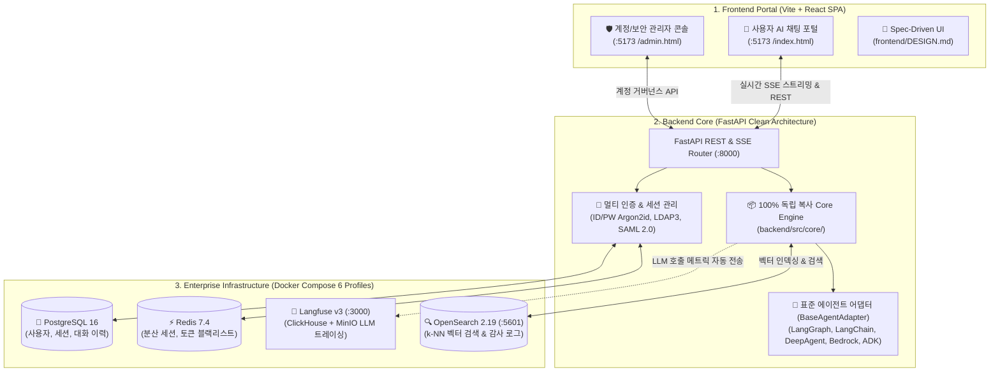

<div align="center">
  

  # AgentForge ⚡

  > **Fast, Standalone & Production-Ready AI Agent Framework**  
  > 프론트엔드, 백엔드, 로컬 인프라부터 Kubernetes 배포까지 단 한 줄로 완성하는 엔터프라이즈 풀스택 에이전트 프레임워크

  [](https://www.python.org/)
  [](LICENSE)
  [](#-공식-문서-가이드-허브-documentation-hub)
  [](docs/skills.md)
  [-blueviolet.svg)](docs/architecture.md#3-스펙-기반-ui-개발--ai-에이전트-협업-체계-frontenddesignmd)
  [](docs/sandbox.md)
  [](docs/quickstart.md)
</div>

---

## ⚡ 빠른 시작 (Quick Start)

### 📌 사전 요구사항 (Prerequisites)
* **Python**: `3.12` 이상 (3.12 또는 3.13 권장)
* **컨테이너**: `Docker` 및 `Docker Compose v2` (로컬 인프라 구동용)
* **Node.js**: `18.0.0` 이상 (로컬 프론트엔드 개발 시)

```bash
# 1. AgentForge 저장소 클론 및 자동 설치 (권장)
git clone https://github.com/bulgemi/AgentForge.git
cd AgentForge
./install.sh                   # Windows: install.bat

# 또는 uv / pip를 통한 Git 직접 설치
# uv tool install git+https://github.com/bulgemi/AgentForge.git
# pip install git+https://github.com/bulgemi/AgentForge.git

# 2. 독립형 풀스택 에이전트 프로젝트 생성
af new my-agent --framework langgraph --frontend react

# 3. 프로젝트 이동 및 LLM API 키 설정
cd my-agent
# backend/.env 파일에서 사용할 LLM 공급자의 API 키를 입력합니다:
# OPENAI_API_KEY=sk-... (또는 GOOGLE_API_KEY, ANTHROPIC_API_KEY)

# 4. 원클릭 인프라 & 풀스택 개발 서버 기동
./run.sh                       # Windows: run.bat
```

> ⚠️ **주의 (PyPI 패키지명 안내)**:  
> PyPI에 존재하는 동명의 `agentforge` 패키지는 본 프로젝트와 무관한 제3자 라이브러리입니다. 반드시 위와 같이 **Git 저장소 기반**(`install.sh` 또는 `git+https://...`)으로 설치해 주십시오.

---

## 🏛️ 시스템 아키텍처 개요 (System Architecture)

AgentForge로 생성된 프로젝트는 비즈니스 로직, 프론트엔드 포털, 엔터프라이즈 인프라가 완벽히 결합된 독립형 모노레포 구조를 제공합니다:



---

## 🌐 주요 서비스 접속 엔드포인트 요약 (Service URLs)

프로젝트 루트에서 `./run.sh` 실행 시 동시 기동되는 주요 서비스의 접속 주소입니다:

| 서비스 | 접속 URL | 기본 로그인 계정 | 설명 |
| :--- | :--- | :--- | :--- |
| **사용자 AI 채팅 포털** | [http://localhost:5173](http://localhost:5173) | `admin` / `admin1234!` | 실시간 SSE 토큰 스트리밍 대화 포털 |
| **보안 관리자 콘솔** | [http://localhost:5173/admin.html](http://localhost:5173/admin.html) | `admin` / `admin1234!` | 계정 프로비저닝, 권한 및 비밀번호 관리 |
| **백엔드 대화형 API (Swagger)** | [http://localhost:8000/docs](http://localhost:8000/docs) | - | OpenAPI 표준 REST API 명세 및 테스트 |
| **Langfuse LLM 관측성** | [http://localhost:3000](http://localhost:3000) | 최초 접속 시 가입 | LLM 레이턴시, TTFT, 토큰 비용 트레이싱 |
| **OpenSearch Dashboards** | [http://localhost:5601](http://localhost:5601) | `admin` / `admin` | k-NN 벡터 인덱스 및 감사 로그 시각화 |
| **Locust 대화형 부하테스트** | [http://localhost:8089](http://localhost:8089) | - | `backend/load_test/run.sh` 실행 시 오픈 |

---

## 🌟 왜 AgentForge인가요? (핵심 가치 제안)

| 구분 | 기존 프레임워크 한계 | ✨ **AgentForge 핵심 혁신** | 사용자 이점 |
| :--- | :--- | :--- | :--- |
| **의존성 (Dependency)** | 중앙 코어를 import하는 종속형 | **Core 엔진 100% 독립 복사 (Standalone)** | 프레임워크 패키지 변경 없이 단독 레포로 배포 및 커스텀 가능 |
| **에이전트 유연성** | 특정 라이브러리 1종 고정 | **코어 8종 어댑터 & 5대 턴키 템플릿 지원** | LangGraph, LangChain, DeepAgent, ADK, Bedrock 등 자유 전환 |
| **AI 협업 통제 & 코드 이해** | AI의 임의 파일 수정 및 복잡한 코드 파악 곤란 | **`.agents/skills/` 8단계 하네스 & `code-tutor`** | 분석 → 설계 → 승인 게이트 → 구현 및 2단계 Mermaid+ELI15 도식화 |
| **UI/UX 일관성** | 개발자마다 제각각인 스타일링 | **Spec-Driven UI (`frontend/DESIGN.md`)** | 디자인 토큰과 제약 규칙을 AI의 Single Source of Truth로 연동 |
| **인프라 부하** | 모든 무거운 컨테이너 강제 기동 | **Docker Compose 6개 프로파일 선택 구동** | 불필요한 리소스 낭비 없이 필요한 스택(`infra`, `search` 등)만 실행 |

---

## 📚 공식 문서 가이드 허브 (Documentation Hub)

| 가이드 문서 | 주요 내용 | 추천 대상 |
| :--- | :--- | :--- |
| [**⚡ 3분 사용자 퀵스타트**](docs/quickstart.md) | 프로젝트 생성부터 로그인, 대화 화면 및 관리자 콘솔 UI 둘러보기 | AgentForge를 처음 시작하는 모든 사용자 |
| [**⚙️ CLI & 스캐폴딩 완전 가이드**](docs/cli.md) | `af new`, `dev`, `build`, `deploy` 옵션, Python API, 5단계 합성 엔진 | CLI 파라미터 및 자동화 파이프라인 구축자 |
| [**🏗️ 아키텍처 & 프레임워크 가이드**](docs/architecture.md) | Clean Architecture 모노레포, 에이전트 어댑터, Spec-Driven UI, 엔터프라이즈 기능 | 백엔드/프론트엔드 아키텍처를 깊이 이해하려는 개발자 |
| [**🛠️ AI 개발 하네스 (Skills) 가이드**](docs/skills.md) | `feature-development`, `feature-enhancement`, `bugfix`, `code-tutor`, 8단계 파이프라인 | AI 코딩 도구(Cursor, Claude Code, Antigravity) 사용자 |
| [**🐳 로컬 인프라 & 배포 가이드**](docs/infrastructure.md) | Docker Compose 6개 프로파일, 서비스 스택, 대시보드 URL, K8s 클러스터 배포 | 로컬 인프라 제어 및 클라우드 배포 운영자 |
| [**🏖️ 멀티 CSP 샌드박스 가이드**](docs/sandbox.md) | AWS/GCP/Azure/로컬 K8s 및 Rancher 온디맨드 샌드박스, 실시간 핫리로드, 절전 모드 | 클라우드 원격 개발 및 실시간 코드 동기화 개발자 |
| [**🌱 환경 변수 & 거버넌스 가이드**](docs/env-vars.md) | 백엔드/프론트엔드 `.env` & `.env.sample` 전체 레퍼런스 및 보안 수칙 | 보안 설정 및 환경 변수 연동 엔지니어 |

---

## 🚀 핵심 기능 하이라이트 (Core Highlights)

### 1. 🤖 표준 에이전트 어댑터 패턴 (`BaseAgentAdapter`)
- **지원 프레임워크**: LangGraph(기본), LangChain, DeepAgent, ADK, AWS Bedrock (코어 레지스트리에 LlamaIndex, Google GenAI, CrewAI, AutoGen 추가 내장)
- 어떤 프레임워크를 선택하더라도 동일한 REST API(`/invoke`, `/health`), SSE 실시간 스트리밍(`/stream`), Human-in-the-loop 인터럽트 승인 규격을 보장합니다.

### 2. 🎨 Spec-Driven UI Development (`frontend/DESIGN.md`)
- `frontend/DESIGN.md`에 브랜드 색상, 8pt 그리드 여백, 시맨틱 토큰, 품질 제약(Do's & Don'ts)을 명시합니다.
- AI 코딩 어시스턴트(Cursor, Claude Code, Windsurf, Antigravity)가 `DESIGN.md`를 단일 진실 공급원(SSOT)으로 삼아 완벽한 UI 일관성을 유지합니다.

### 3. 🛠️ `.agents/skills/` 표준 AI 개발 하네스 & 코드 튜터
- **4대 특화 스킬**: `신규 기능(feature-development)`, `기능 개선(feature-enhancement)`, `버그 수정(bugfix)`, `코드/아키텍처 튜터(code-tutor)`
- **8단계 파이프라인**: `분석` → `파일 단위 설계([NEW]/[MODIFY])` → `오버엔지니어링 검토` → `★사용자 승인 게이트` → `GitHub Issue/태그 등록` → `구현` → `코드 리뷰` → `기능 점검(신규/회귀 테스트)` → `이슈 종료`
- **code-tutor**: 개발자/아키텍트를 위한 2단계 하이브리드 Mermaid 도식화(컴포넌트 구조도 + 런타임 시퀀스) 및 ELI15 Q&A 탐구형 스토리텔링 해설 제공.

### 4. 🐳 멀티 프로파일 로컬 인프라 & K8s 배포
- **PostgreSQL 16** + **Redis 7.4** + **Langfuse v3** (ClickHouse + MinIO) + **OpenSearch 2.19.3**
- `--profile infra`, `--profile observability`, `--profile search`, `--profile all` 등 필요한 스택만 선택 가동할 수 있습니다.

### 5. 📊 자동 생성 실전형 부하테스트 (`backend/load_test/`)
- **실전형 시나리오 내장**: 로그인 ➔ 대화방 생성 ➔ 5개 순차 기술 질문 SSE 스트리밍 문답 ➔ 로그아웃 전 과정을 시뮬레이션합니다.
- **LLM 특화 지표 분리**: 첫 토큰 도달 지연 시간(**TTFT**)과 전체 스트리밍 완료 소요 시간(**Total Latency**)을 Locust 커스텀 이벤트로 분리 집계합니다.
- **실행**: `backend/load_test/`에서 `./run.sh`(Web UI :8089) 또는 `./run.sh --headless -u 50`(HTML 리포트 자동 생성)로 즉시 실행할 수 있습니다.

### 6. 🏖️ 온디맨드 멀티 CSP 개발자 샌드박스 (`af sandbox`)
- **멀티 CSP & Rancher 통합**: AWS EKS, GCP GKE, Azure AKS 및 Rancher 환경에서 개발자별 격리 네임스페이스(`sandbox-<user>`)를 원클릭 프로비저닝합니다.
- **프로젝트 전용 러너 (`./af`, `af.bat`)**: 전역 CLI 설치 없이도 생성된 프로젝트 루트의 `./af sandbox up`으로 즉시 실행 가능합니다.
- **0.5초 라이브 핫리로드 (`af sandbox watch`)**: 로컬 소스 수정 시 Docker 재빌드 없이 원격 Pod로 변경 사항을 0.5초 내 직접 동기화합니다.
- **비용 0원 절전**: `af sandbox pause`(Replicas=0)로 클라우드 비용을 즉시 절감하고 `af sandbox resume`으로 복원합니다.
- **로컬 0원 검증 (Minikube)**: Minikube 클러스터 감지 시 컨테이너 이미지를 자동 빌드 및 노드로 즉시 적재(`--build`)합니다.
  > 📖 환경별 Rancher 연동 매트릭스 및 트러블슈팅은 [온디맨드 샌드박스 가이드 (`docs/sandbox.md`)](docs/sandbox.md)를 참조하세요.

---

## ⚡ CLI 명령어 요약 (CLI Cheat Sheet)

| 명령어 | 설명 | 예시 |
| :--- | :--- | :--- |
| **`af new <name>`** | 신규 독립형 프로젝트 스캐폴딩 | `af new my-bot -f langgraph -ui react` |
| **`af dev`** | 로컬 백엔드 & 프론트엔드 동시 실행 | `af dev --port 8000 --ui-port 5173` |
| **`af build`** | 프로덕션 Docker 컨테이너 이미지 빌드 | `af build --tag v1.0.0 --target all` |
| **`af deploy`** | Kubernetes 클러스터 매니페스트 배포 | `af deploy --env dev --namespace ai-agents` |
| **`af sandbox up`** | 클라우드/로컬 K8s 격리 샌드박스 생성 | `af sandbox up --csp aws --ttl 8h` |
| **`af sandbox watch`**| 로컬 코드 변경 사항 원격 Pod 실시간 동기화 | `af sandbox watch` |
| **`af sandbox pause`**| 샌드박스 Pod 복제본 0 축소 (비용 절감) | `af sandbox pause` |

---

## 📁 생성되는 프로젝트 기본 구조 (Project Layout)

```text
my-awesome-agent/
├── .agents/skills/                # 🤖 기본 탑재 AI 개발 하네스 & 튜터 (feature, enhancement, bugfix, code-tutor)
├── .vscode/                       # 💻 F5 원클릭 디버깅 환경 (launch.json, settings.json)
├── af / af.bat                    # ⚡ 무설치 프로젝트 전용 러너 (sandbox, dev, build, deploy)
├── run.sh / run.bat               # 원클릭 인프라 & 개발 서버 동시 실행 스크립트
├── setup.sh / setup.bat           # 의존성 사전 구성 스크립트
├── backend/                       # FastAPI 백엔드 (Clean Architecture: domain, application, infra)
│   ├── src/core/                  # 100% 독립 복사된 Core 엔진 (adapter, streaming, database, config)
│   ├── load_test/                 # 📊 Locust 부하테스트 환경 (locustfile.py, questions.json, run.sh)
│   ├── .env & .env.sample         # 백엔드 활성 환경 변수 및 공개 템플릿
│   └── pyproject.toml             # uv / pyproject 기반 의존성 정의
├── frontend/                      # Vite + React Dual-SPA 포털
│   ├── index.html                 # 💬 사용자 AI 채팅 포털 진입점
│   ├── admin.html                 # 🛡️ 계정/보안 관리자 콘솔 진입점
│   ├── DESIGN.md                  # 공식 UI/UX 디자인 시스템 & AI 코딩 에이전트 협업 규칙
│   └── .env & .env.sample         # 프론트엔드 환경 변수
├── docker-compose.yml             # 로컬 통합 인프라 (Postgres, Redis, Langfuse, OpenSearch 6개 프로파일)
├── k8s/                           # 환경 분리형 Kubernetes 실전 배포 매니페스트 (dev, prd, k8s-deploy.sh)
└── README.md                      # 프로젝트 전용 안내 문서
```

---

## 🛠️ 개발 및 기여 가이드 (Contributing)

```bash
# 1. 저장소 클론
git clone https://github.com/bulgemi/AgentForge.git
cd AgentForge

# 2. 가상환경 구성 및 개발 의존성 설치
./install.sh                   # Windows: install.bat
# 또는 uv 사용 시: uv pip install -e ".[dev]"

# 3. 환경 활성화 및 테스트 실행
source .venv/bin/activate      # Windows: .venv\Scripts\activate
pytest
```

---

## 📄 라이선스 (License)

이 프로젝트는 [MIT License](LICENSE)에 따라 배포됩니다.
