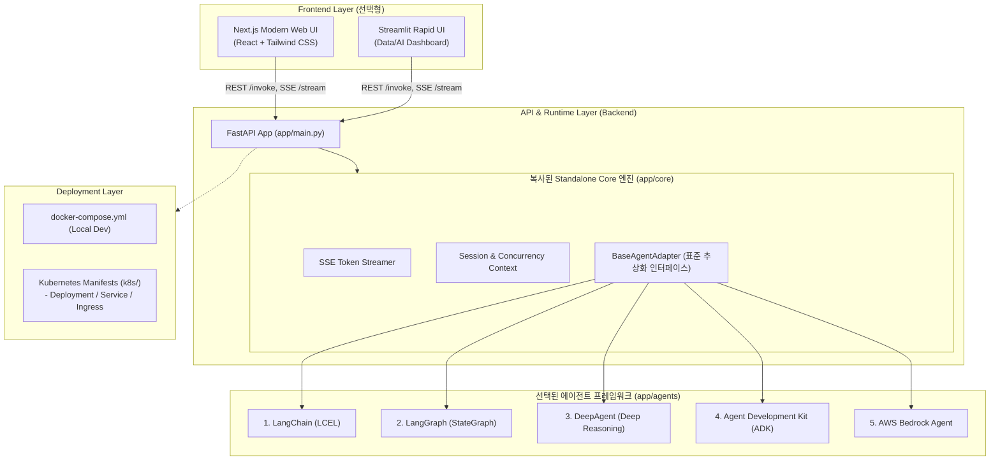

# AgentForge ⚡

> **Fast, Standalone & Production-Ready AI Agent Framework**  
> 빠른 AI 에이전트 개발을 위해 프론트엔드, 백엔드, Kubernetes 배포까지 풀스택 독립형 아키텍처를 자동 생성하는 오픈소스 프레임워크입니다.

[](https://www.python.org/)
[](LICENSE)
[](#-생성되는-프로젝트-구조)
[](#-지원-에이전트-프레임워크-5종)

---

## 🌟 개요 (Overview)

**AgentForge**는 기존 [FastLangFrame](https://github.com/bulgemi/FastLangFrame)의 설계 철학을 계승하고, 실제 현업 및 프로덕션 환경에서의 한계점을 혁신적으로 개선한 차세대 AI 에이전트 스캐폴딩 & 런타임 프레임워크입니다.

### 💡 FastLangFrame 대비 무엇이 달라졌나요?

| 구분 | 기존 FastLangFrame | ✨ **AgentForge** |
| :--- | :--- | :--- |
| **프로젝트 생성 위치** | 프레임워크 내부 `projects/` 고정 | **사용자가 원하는 로컬 임의 경로(`--path`) 자유 지정** |
| **코어 코드 의존성** | 중앙 코어 모듈을 참조(`import`)하는 종속형 구조 | **Core 엔진을 생성 프로젝트에 복사하여 100% 독립 실행(Standalone)** |
| **에이전트 프레임워크** | LangChain / LangGraph 중심 | **LangChain, LangGraph, DeepAgent, ADK, AWS Bedrock 5종 전폭 지원** |
| **인프라 의존성 (Bloat)** | Authelia, Nginx, Redis, DB 등 기본 탑재 (무거움) | **초경량 최소화 (Zero Bloat): 불필요한 외부 의존성 제거, 즉시 실행** |
| **스택 범위** | 백엔드 API + 일부 테스트 UI 위주 | **Frontend (Next.js/Streamlit) + Backend (FastAPI) + K8s 매니페스트 풀스택 생성** |
| **템플릿 시스템** | 레거시 복잡 템플릿 | **현대적 코드베이스 기반 신규 클린 템플릿 전면 재작성** |
| **CLI 생태계** | 저장소 스크립트(`bin/lapm`) 실행 방식 | **독립 설치형 글로벌 CLI (`agentforge`, `af`) 풀 라이프사이클 지원** |

---

## 🏗️ 아키텍처 (Architecture)

AgentForge로 생성된 프로젝트는 **풀스택 모노레포** 형태로 구성되며, 각 티어가 느슨하게 결합되어 독립적으로 실행·배포될 수 있습니다.



---

## 🤖 지원 에이전트 프레임워크 5종

AgentForge는 백엔드 표준 어댑터(`BaseAgentAdapter`) 패턴을 내장하여, 어떤 프레임워크를 선택하더라도 클라이언트와 표준화된 규격으로 통신합니다.

| 프레임워크 | 설명 | 특징 및 추천 활용처 | 공식 링크 |
| :--- | :--- | :--- | :--- |
| **1. LangChain** | 엔드투엔드 LLM 체인 구성의 표준 | 전통적인 프롬프트 체이닝, 간단한 Tool Calling 에이전트 | [공식 문서](https://www.langchain.com/) |
| **2. LangGraph** | 순환형(Cyclic) 그래프 및 분기 상태 제어 | 정교한 Multi-Turn 대화, Human-in-the-loop, 다중 에이전트 제어 | [공식 문서](https://www.langchain.com/langgraph) |
| **3. DeepAgent** | 심층 추론(Deep Reasoning) 및 계획 수립 에이전트 | 단계별 사고 과정(Thinking), 연구 및 복합 문제 분석 특화 | [공식 문서](https://docs.langchain.com/oss/python/deepagents/overview) |
| **4. ADK (Agent Development Kit)** | 모듈식 경량 에이전트 개발 키트 | 표준 도구 및 컴포넌트 조합형 엔지니어링 에이전트 | [공식 문서](https://adk.dev/) |
| **5. AWS Bedrock** | AWS 네이티브 완전관리형 AI 에이전트 | 엔터프라이즈 AWS 보안/규정 준수, Bedrock Agents 및 Knowledge Base 연동 | [공식 문서](https://aws.amazon.com/ko/bedrock/) |

> 📌 **표준 API 보장**: 모든 프레임워크 어댑터는 동일한 엔드포인트를 제공합니다.
> - `POST /invoke` : 단일 프롬프트 동기 블로킹 호출
> - `POST /stream` : 실시간 토큰 및 이벤트 스트리밍 (Server-Sent Events, SSE)
> - `GET /health` : 서비스 상태 및 에이전트 로딩 헬스체크

---

## 📁 생성되는 프로젝트 구조

`agentforge new` 명령으로 생성된 프로젝트는 외부 프레임워크 저장소에 전혀 의존하지 않는 완전한 독립형 프로젝트입니다.

```text
my-awesome-agent/
├── backend/                       # FastAPI 백엔드
│   ├── app/
│   │   ├── api/                   # REST 엔드포인트 라우터 (/invoke, /stream, /health)
│   │   ├── core/                  # 복사된 독립형 Standalone Core 엔진
│   │   │   ├── adapter.py         # 표준 BaseAgentAdapter 인터페이스
│   │   │   ├── config.py          # 환경변수(Pydantic Settings) 및 설정
│   │   │   ├── logging.py         # 구조화 로깅
│   │   │   └── streaming.py       # 실시간 SSE 스트리머 런타임
│   │   ├── agents/                # 선택한 에이전트 구현체 (LangChain/LangGraph/Bedrock 등)
│   │   │   ├── agent.py           # 구체적인 에이전트 프롬프트 및 비즈니스 로직
│   │   │   └── tools/             # 에이전트 사용 커스텀 도구 정의
│   │   └── main.py                # FastAPI 진입점
│   ├── Dockerfile                 # 백엔드 경량 컨테이너 빌드 파일
│   ├── requirements.txt           # 선택된 에이전트 프레임워크에 최적화된 패키지
│   └── pyproject.toml
│
├── frontend/                      # 선택한 프론트엔드 (Next.js 또는 Streamlit)
│   ├── src/                       # (Next.js 선택 시) 모던 챗 인터페이스 & 반응형 컴포넌트
│   │   ├── components/
│   │   └── pages/
│   ├── Dockerfile                 # 프론트엔드 컨테이너 빌드 파일
│   └── package.json (or app.py)
│
├── k8s/                           # Kubernetes 배포 매니페스트 (Kustomize/기본 매니페스트)
│   ├── backend-deployment.yaml    # 백엔드 Deployment & Service
│   ├── frontend-deployment.yaml   # 프론트엔드 Deployment & Service
│   ├── ingress.yaml               # 통합 라우팅 Ingress (선택사항)
│   └── configmap.yaml             # 환경설정
│
├── docker-compose.yml             # 로컬 통합 원클릭 실행 (Frontend + Backend)
├── .env.example                   # API Key 등 환경 변수 템플릿
└── README.md                      # 프로젝트 전용 가이드
```

---

## 🚀 빠른 시작 (Quick Start)

### 1. AgentForge CLI 설치

```bash
# pip를 통한 설치
pip install agentforge

# 또는 uv / pipx를 통한 초고속 설치
uv tool install agentforge
```

### 2. 새 프로젝트 생성 (`agentforge new`)

원하는 위치에 프로젝트 이름, 사용할 에이전트 프레임워크, 프론트엔드 유형을 지정하여 생성합니다.

```bash
# 기본 사용법
agentforge new <프로젝트명> --framework <프레임워크> --frontend <프론트엔드> --path <경로>

# 예시 1: LangGraph + Next.js 조합으로 현재 디렉토리에 생성
agentforge new customer-agent --framework langgraph --frontend nextjs --path .

# 예시 2: AWS Bedrock + Streamlit 조합으로 특정 디렉토리에 생성
agentforge new enterprise-bot --framework bedrock --frontend streamlit --path /data/projects

# 대화형 모드 (옵션을 지정하지 않으면 인터랙티브 마법사 실행)
agentforge init
```

#### 옵션 플래그 상세

| 옵션 | 단축형 | 설명 | 선택값 |
| :--- | :--- | :--- | :--- |
| `--framework` | `-f` | 에이전트 개발 프레임워크 | `langchain`, `langgraph`, `deepagent`, `adk`, `bedrock` |
| `--frontend` | `-ui` | 프론트엔드 인터페이스 | `nextjs`, `streamlit`, `none` (headless 백엔드) |
| `--path` | `-p` | 프로젝트가 생성될 디렉토리 경로 | 기본값: 현재 작업 디렉토리 (`.`) |

---

## 💻 CLI 도구 명령어 (`agentforge` / `af`)

AgentForge CLI는 프로젝트 스캐폴딩부터 로컬 테스트, 빌드, 배포까지 전 주기(Full Lifecycle)를 지원합니다.

### 1) 로컬 개발 서버 실행 (`dev`)
백엔드(FastAPI)와 프론트엔드(Next.js/Streamlit)를 한 번에 실행합니다.
```bash
cd <프로젝트디렉토리>
agentforge dev
# Backend: http://localhost:8000 (API Docs: http://localhost:8000/docs)
# Frontend: http://localhost:3000 (Next.js) 또는 http://localhost:8501 (Streamlit)
```

### 2) Docker 이미지 빌드 (`build`)
배포를 위한 프로덕션 컨테이너 이미지를 빌드합니다.
```bash
agentforge build --tag v1.0.0
# backend:v1.0.0 및 frontend:v1.0.0 이미지 생성
```

### 3) Kubernetes 클러스터 배포 (`deploy`)
`k8s/` 매니페스트를 타겟 클러스터에 배포합니다.
```bash
agentforge deploy --namespace ai-agents
```

---

## 🛠️ 개발 및 기여 가이드 (Contributing)

AgentForge는 오픈소스 프로젝트로서 커뮤니티의 기여를 적극 환영합니다.

```bash
# 1. 저장소 클론
git clone https://github.com/bulgemi/AgentForge.git
cd AgentForge

# 2. 개발 환경 설정
poetry install  # 또는 pip install -e ".[dev]"

# 3. 테스트 실행
pytest
```

새로운 에이전트 프레임워크 어댑터 추가, 프론트엔드 템플릿 개선, K8s 매니페스트 최적화 등 다양한 기여를 기다립니다. 이슈와 PR을 편하게 남겨주세요!

---

## 📄 라이선스 (License)

이 프로젝트는 [MIT License](LICENSE)에 따라 배포됩니다.
