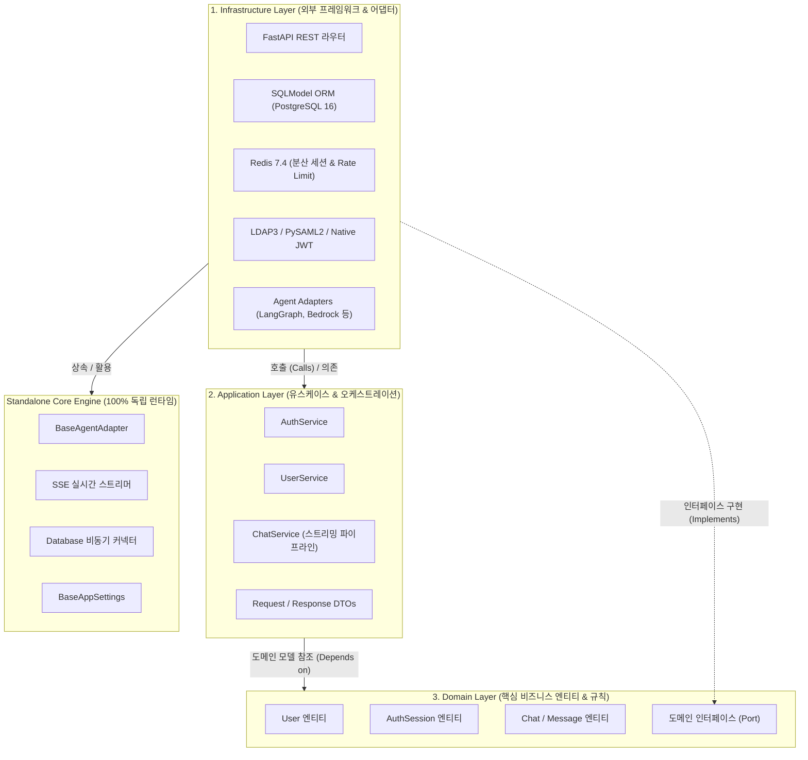
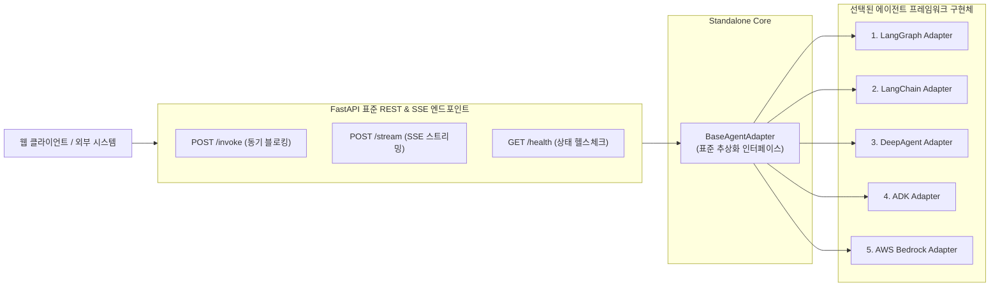
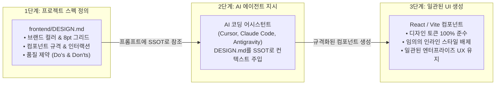
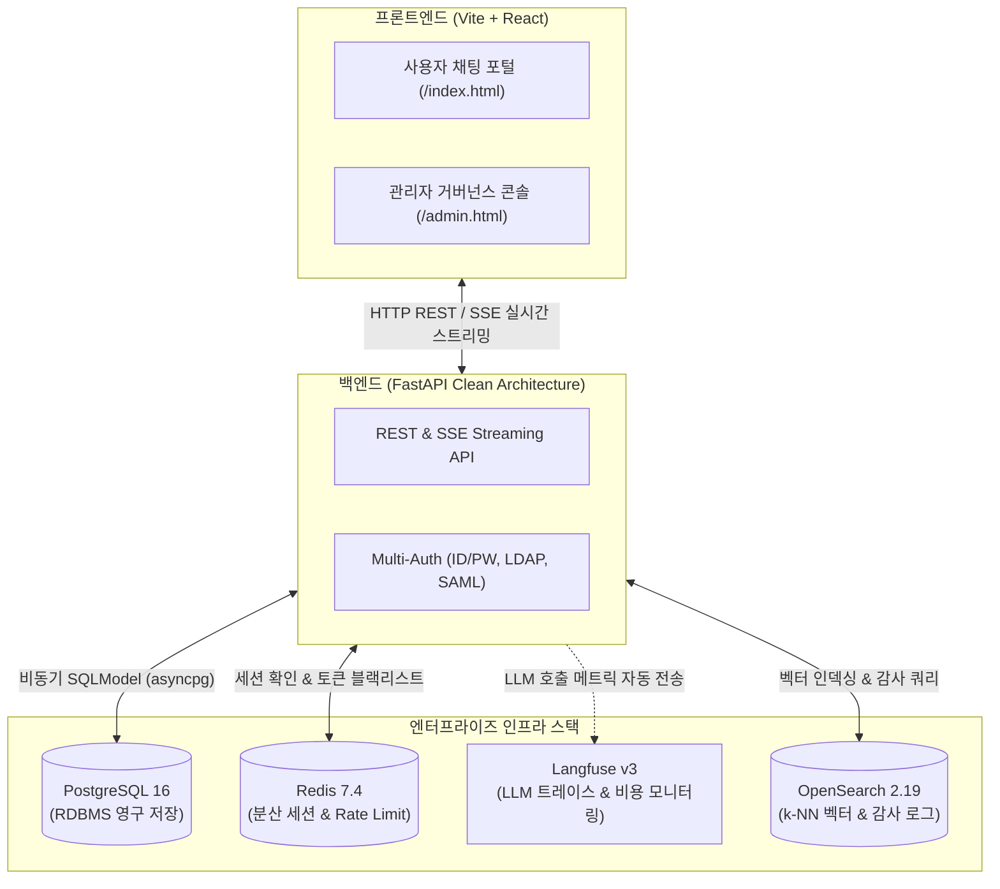

# 🏗️ 아키텍처 & 프레임워크 가이드 (Architecture Guide)

> [🏠 README](../README.md) &nbsp;|&nbsp; [⚡ Quickstart](quickstart.md) &nbsp;|&nbsp; [⚙️ CLI & Scaffolding](cli.md) &nbsp;|&nbsp; **[🏗️ Architecture](architecture.md)** &nbsp;|&nbsp; [🛠️ AI Skills](skills.md) &nbsp;|&nbsp; [🐳 Infrastructure](infrastructure.md) &nbsp;|&nbsp; [🌱 Env Variables](env-vars.md)

---

AgentForge는 엔터프라이즈 환경에서 검증된 **Clean Architecture 모노레포 패턴**과 **독립형 코어 엔진(Standalone Core)**을 채택하여 비즈니스 로직과 외부 인프라를 완벽히 격리합니다.

---

## 1. 클린 아키텍처 계층 구조 (Clean Architecture)

생성된 백엔드(`backend/src/`)는 의존성 역전 원칙(DIP)에 따라 내부 도메인이 외부 프레임워크나 데이터베이스에 의존하지 않도록 엄격히 계층화되어 있습니다:



| 계층 (Layer) | 위치 | 책임 및 구현 내용 |
| :--- | :--- | :--- |
| **Domain** | `backend/src/domain/` | 사용자(`User`), 세션(`AuthSession`), 대화(`Chat`) 등 순수 도메인 엔티티와 비즈니스 불변식(Invariants), 인터페이스 정의 |
| **Application** | `backend/src/application/` | 유스케이스 구현체(`AuthService`, `UserService`, `ChatService`) 및 요청/응답 DTO 스키마 |
| **Infrastructure** | `backend/src/infrastructure/` | DB 테이블 매핑, Redis 분산 세션 어댑터, LDAP3/SAML2 인증 구현체, REST API 라우터 |
| **Core Engine** | `backend/src/core/` | 100% 독립 복사된 표준 어댑터(`BaseAgentAdapter`), Pydantic Settings 베이스, 로깅, SSE 실시간 스트리머 |

---

## 2. 지원 에이전트 프레임워크 5종 (`BaseAgentAdapter`)

AgentForge는 백엔드 표준 어댑터(`BaseAgentAdapter`) 패턴을 내장하여, 어떤 프레임워크를 선택하더라도 클라이언트와 표준화된 규격으로 통신합니다.



| 프레임워크 | 설명 | 특징 및 추천 활용처 | 공식 링크 |
| :--- | :--- | :--- | :--- |
| **1. LangChain** | 엔드투엔드 LLM 체인 구성의 표준 | 전통적인 프롬프트 체이닝, 간단한 Tool Calling 에이전트 | [공식 문서](https://www.langchain.com/) |
| **2. LangGraph** | 순환형(Cyclic) 그래프 및 분기 상태 제어 | 정교한 Multi-Turn 대화, Human-in-the-loop, 다중 에이전트 제어 | [공식 문서](https://www.langchain.com/langgraph) |
| **3. DeepAgent** | 심층 추론(Deep Reasoning) 및 계획 수립 에이전트 | 단계별 사고 과정(Thinking), 연구 및 복합 문제 분석 특화 | [공식 문서](https://docs.langchain.com/oss/python/deepagents/overview) |
| **4. ADK (Agent Development Kit)** | 모듈식 경량 에이전트 개발 키트 | 표준 도구 및 컴포넌트 조합형 엔지니어링 에이전트 | [공식 문서](https://adk.dev/) |
| **5. AWS Bedrock** | AWS 네이티브 완전관리형 AI 에이전트 | 엔터프라이즈 AWS 보안/규정 준수, Bedrock Agents 및 Knowledge Base 연동 | [공식 문서](https://aws.amazon.com/ko/bedrock/) |

### 📌 표준 API 엔드포인트 규격
모든 어댑터는 프레임워크의 종류와 무관하게 동일한 백엔드 엔드포인트를 제공합니다:
- `POST /invoke` : 단일 프롬프트 동기 블로킹 호출 (요청: `{"prompt": "..."}`)
- `POST /stream` : 실시간 토큰 및 이벤트 스트리밍 (Server-Sent Events, SSE)
- `GET /health` : 서비스 상태 및 에이전트 모델 로딩 헬스체크

---

## 3. 스펙 기반 UI 개발 & AI 에이전트 협업 체계 (`frontend/DESIGN.md`)

AgentForge의 프론트엔드는 AI 코딩 도구(Cursor, Windsurf, Claude Code, Antigravity)와의 정밀한 협업을 위해 **Spec-Driven UI Development** 방법론을 채택하고 있습니다.

### 🔄 개발 워크플로우 3단계



1. **1단계: 프로젝트 고유 스펙 정의 (`frontend/DESIGN.md` 수정)**
   - 브랜드 색상, 타이포그래피, 8pt 그리드 여백 배수 (`p-2`, `p-4`, `p-6`) 정의
   - 사용자 경험에 필요한 카드, 모달, 폼, 데이터 테이블 등의 세부 규격 기술
   - 실시간 토큰 스트리밍, Human-in-the-Loop(HITL) 도구 승인, 실행 로그 콘솔 규칙 명시
2. **2단계: AI 에이전트 지시 (Single Source of Truth 연동)**
   - 프롬프트 예시:
     > *"Follow the UI specifications in `frontend/DESIGN.md`. Implement the user analytics dashboard adhering strictly to our defined color tokens, 8pt spacing, and Lucide icons."*
3. **3단계: 일관된 UI 생성 및 유지보수**
   - AI 에이전트는 `DESIGN.md`의 제약 규칙(임의 hex 클래스 금지, 단일 아이콘 패밀리 원칙 등)을 준수하여 전체 애플리케이션의 UI/UX 일관성을 영구적으로 유지합니다.

---

## 4. 엔터프라이즈 기능 및 시스템 인터랙션 (Enterprise Features)

생성된 프로젝트는 엔터프라이즈 상용 서비스에 필수적인 기능들이 기본 통합되어 유기적으로 통신합니다:



- **엔터프라이즈 멀티 인증**: 로컬 DB(ID/PW, Argon2id 암호화 해싱), LDAP / Active Directory 바인딩, SAML 2.0 IdP 싱글사인온(SSO)
- **분산 세션 & 보안**: Redis 7.4 기반 세션 만료, 동시 로그인 제한, 토큰 블랙리스트, Native JWT 발급
- **전방위 옵저버빌리티 (Langfuse v3)**: ClickHouse + MinIO 백엔드 연동, 에이전트 토큰 소비량 및 LLM 레이턴시 자동 추적
- **지능형 검색 & 벡터 인덱싱**: OpenSearch 2.19.3 + OpenSearch Dashboards 사전 연동, k-NN 벡터 인덱스 템플릿 기본 탑재
- **관리자 거버넌스 포털 (`/admin.html`)**: 사용자 등록/수정/삭제, 계정 잠금 해제, 비밀번호 초기화 콘솔

---

## 5. 프로젝트 전체 디렉토리 레이아웃 (Project Layout)

```text
my-awesome-agent/
├── .agents/skills/                # 🤖 기본 탑재 AI 개발 하네스 (Antigravity/Agent 표준)
│   ├── feature-development/       # 신규 기능 개발 하네스 (SKILL.md)
│   ├── feature-enhancement/       # 기존 기능 개선/리팩토링 하네스 (SKILL.md)
│   ├── bugfix/                    # RCA & 재현 실패 테스트 주도 버그 수정 하네스 (SKILL.md)
│   └── shared/                    # 8단계 워크플로우 명세 및 GitHub 라벨 규약 (workflow-spec.md)
├── .gitignore                     # Git 제외 설정 (backend/.env, frontend/.env 제외, *.env.sample 커밋)
├── run.sh                         # macOS/Linux 원클릭 의존성 설치 & 서버 동시 실행 (.env 자동 초기화)
├── run.bat                        # Windows 원클릭 의존성 설치 & 서버 동시 실행 (.env 자동 초기화)
├── setup.sh                       # macOS/Linux 의존성 사전 구성 스크립트 (.env 자동 초기화)
├── setup.bat                      # Windows 의존성 사전 구성 스크립트 (.env 자동 초기화)
├── backend/                       # FastAPI 기반 백엔드 (Clean Architecture 계층 구조)
│   ├── .env                       # 백엔드 활성 로컬 환경 변수 (스캐폴딩 시 기본값 자동 치환)
│   ├── .env.sample                # 백엔드 전체 환경 변수 가이드 및 참조 템플릿
│   ├── src/                       # 백엔드 핵심 소스
│   │   ├── core/                  # 복사된 독립형 Standalone Core 엔진 (adapter, config, database, logging, streaming)
│   │   ├── domain/                # 사용자(User), 세션(AuthSession), 대화(Chat) 엔티티 및 포트
│   │   ├── application/           # 인증 서비스, 사용자 관리 서비스, 대화 서비스 및 DTO
│   │   ├── infrastructure/        # SQLModel 테이블, Native JWT, LDAP3, PySAML2, Redis, REST 라우터
│   │   ├── main.py                # FastAPI 웹 애플리케이션 진입점
│   │   └── bootstrap.py           # Core + Auth 중첩 Lifespan 및 앱 조립 Root
│   ├── alembic/                   # 데이터베이스 마이그레이션 버전 관리
│   ├── Dockerfile                 # 백엔드 프로덕션 멀티스테이지 Dockerfile
│   └── pyproject.toml             # uv / pyproject 기반 의존성 정의
│
├── frontend/                      # Vite + React 멀티 엔트리포인트 포털
│   ├── .env                       # 프론트엔드 활성 로컬 환경 변수 (VITE_* 기본값 자동 치환)
│   ├── .env.sample                # 프론트엔드 환경 변수 가이드 및 참조 템플릿
│   ├── DESIGN.md                  # 공식 UI/UX 디자인 시스템 & AI Coding Agent 협업 규칙
│   ├── README.md                  # 프론트엔드 아키텍처 및 로컬 실행 가이드
│   ├── src/
│   │   ├── api/                   # 백엔드 통신 API 클라이언트 (VITE_API_BASE_URL)
│   │   ├── auth/                  # AuthProvider, LoginForm(ID/PW, LDAP, SAML), useAuth
│   │   ├── components/            # ChatAssistant, TerminalConsole, InterruptApprovalCard
│   │   ├── admin/                 # AdminApp, useAdminRoute (관리자 전용 콘솔)
│   │   ├── App.jsx                # 사용자 채팅 포털 메인 앱
│   │   └── main.jsx
│   ├── index.html                 # 사용자 포털 엔트리 (/index.html)
│   ├── admin.html                 # 관리자 포털 엔트리 (/admin.html)
│   └── vite.config.js             # Vite 번들러 설정
│
├── k8s/                           # 환경 분리형 Kubernetes 실전 배포 매니페스트 (dev, prd, k8s-deploy.sh)
├── docker-compose.yml             # 로컬 통합 인프라 및 애플리케이션 컨테이너 (6개 프로파일 지원)
├── postgres-init/                 # PostgreSQL 16 다중 DB 조건부 프로비저닝 스크립트 (init.sql)
├── config/opensearch/             # OpenSearch 인덱스 템플릿 및 초기화 스크립트
└── README.md                      # 프로젝트 전용 안내 문서
```

---

> [🏠 README](../README.md) &nbsp;|&nbsp; [⚡ Quickstart](quickstart.md) &nbsp;|&nbsp; [⚙️ CLI & Scaffolding](cli.md) &nbsp;|&nbsp; **[🏗️ Architecture](architecture.md)** &nbsp;|&nbsp; [🛠️ AI Skills](skills.md) &nbsp;|&nbsp; [🐳 Infrastructure](infrastructure.md) &nbsp;|&nbsp; [🌱 Env Variables](env-vars.md)
