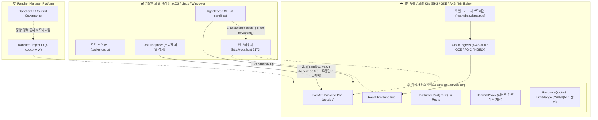
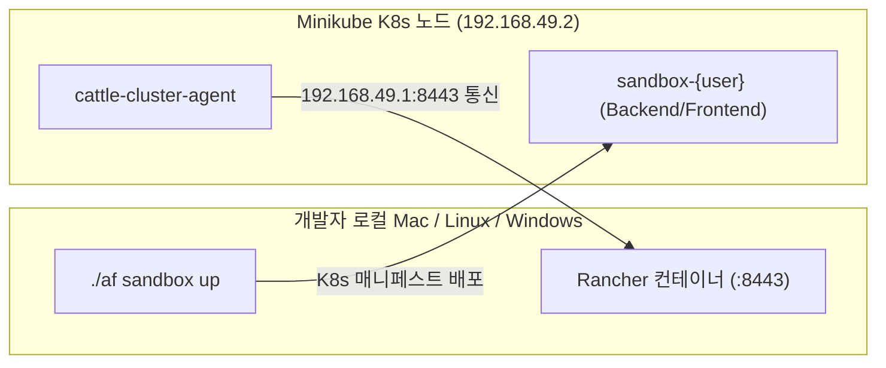

> [🏠 README](../README.md) &nbsp;|&nbsp; [⚡ Quickstart](quickstart.md) &nbsp;|&nbsp; [⚙️ CLI & Scaffolding](cli.md) &nbsp;|&nbsp; [🏗️ Architecture](architecture.md) &nbsp;|&nbsp; [🛠️ AI Skills](skills.md) &nbsp;|&nbsp; [🐳 Infrastructure](infrastructure.md) &nbsp;|&nbsp; **[🏖️ Sandbox](sandbox.md)** &nbsp;|&nbsp; [🌱 Env Variables](env-vars.md)

---

# 🏖️ 온디맨드 멀티 CSP 개발자 샌드박스 가이드 (`af sandbox`)

AgentForge는 **AWS EKS, GCP GKE, Azure AKS** 등 멀티 클라우드 쿠버네티스 환경과 **Rancher(https://github.com/rancher/rancher)** 관리 체계를 연동하여, 개발자마다 독립된 클라우드 샌드박스 환경을 10초 만에 프로비저닝하고 로컬 소스코드를 무중단 실시간 동기화할 수 있는 **온디맨드 개발자 샌드박스 (`af sandbox`)** 기능을 제공합니다.

---

## 1. 샌드박스 아키텍처 및 동작 원리



---

## 2. AgentForge 생성 프로젝트 내 실전 사용법 (In-Project Usage)

`af new my-agent`로 생성된 프로젝트 루트 디렉토리에서 아래 명령어들을 즉시 실행할 수 있습니다.

> 💡 **전역 CLI 미설치 시 `./af` 래퍼 스크립트 활용 (Zero-Install)**:
> 생성된 프로젝트 루트에는 `./af` (macOS/Linux) 및 `af.bat` (Windows) 실행 래퍼가 기본 포함되어 있습니다. 개발자 PC에 `agentforge`가 전역 설치되어 있지 않더라도, `./af sandbox ...` 명령을 실행하면 `uvx`를 통해 별도 설치 없이 즉시 실행됩니다. (전역 CLI 설치 시에는 `af sandbox ...`로 단축 실행 가능)

### 1) 샌드박스 원클릭 프로비저닝 (`af sandbox up` 또는 `./af sandbox up`)

개발자 이름에 기반한 독립 네임스페이스(`sandbox-<user>`), ResourceQuota, NetworkPolicy 거버넌스와 함께 프로젝트의 Kubernetes 워크로드(Backend, Frontend, ConfigMap, Ingress)를 원클릭으로 클러스터에 배포합니다 (RFC 1123 규격 자동 변환 지원):

```bash
# 기본 AWS EKS 환경에 8시간 TTL로 샌드박스 생성 (래퍼 스크립트 사용)
./af sandbox up

# 전역 CLI가 설치된 경우 단축 실행
af sandbox up

# 대상 클라우드 CSP 명시 (AWS EKS, GCP GKE, Azure AKS)
af sandbox up --csp aws --name alice --ttl 8h
af sandbox up --csp gcp --name bob --ttl 4h
af sandbox up --csp azure --name charlie --ttl 24h

# 생성 전 매니페스트 미리보기 (Dry-Run)
af sandbox up --csp aws --name alice --dry-run

# 사설 RDS/CloudSQL 공유 DB 대신 클러스터 내 임베디드 격리 DB 사용
af sandbox up --shared-db=false

# 로컬 K8s(Minikube) 환경에서 컨테이너 이미지 자동 빌드 및 클러스터 적재 (기본값)
af sandbox up --build

# 이미지 빌드를 건너뛰고 매니페스트만 적용
af sandbox up --no-build
```

#### 주요 옵션 플래그
| 플래그 | 단축키 | 기본값 | 설명 |
| :--- | :--- | :--- | :--- |
| `--csp` | `-c` | `aws` | 타겟 클라우드 제공자 (`aws`, `gcp`, `azure`) |
| `--name` | `-n` | 현재 OS 사용자 | 샌드박스 고유 식별자 (`sandbox-{name}` 네임스페이스 생성) |
| `--ttl` | `-t` | `8h` | 샌드박스 유효 기간 (`30m`, `4h`, `8h`, `24h`, `2d`) |
| `--domain` | `-d` | `sandbox.agentforge.io` | 와일드카드 서브도메인 베이스 URL |
| `--shared-db` | - | `false` | 중앙 공유 DB 사용 여부 (`false` 시 파드 내부 격리 DB 기동) |
| `--rancher-project` | `-p` | `None` | 바인딩할 Rancher Project ID |
| `--dry-run` | - | `false` | 클러스터에 적용하지 않고 YAML 매니페스트만 화면 출력 |
| `--watch` | `-w` | `false` | 생성 완료 즉시 소스코드 변경 감지 스트리밍 시작 |
| `--build / --no-build` | - | `true` | 로컬 K8s(Minikube) 감지 시 이미지 자동 빌드 및 노드 적재 (`minikube image load`) |

> 💡 **ImagePullBackOff 방지 & 자동 이미지 동기화**:
> 로컬 Minikube 클러스터에서 실행 시, Kubelet이 원격 레지스트리(Docker Hub)에서 이미지를 찾지 못해 `ImagePullBackOff` 에러가 발생하는 것을 방지하기 위해, AgentForge는 로컬 프로젝트명 기반 컨테이너 이미지를 자동 빌드하고 `minikube image load`를 통해 클러스터 노드로 즉시 전송합니다. 또한 프론트엔드 Nginx 프록시가 K8s 환경에서도 원활히 동작하도록 CoreDNS 호환 `backend` 서비스 alias를 자동 구성합니다.

---

### 2) 실시간 무중단 핫리로드 동기화 (`af sandbox watch`)

로컬 파일시스템의 소스코드 변경을 감지하여 원격 샌드박스 Pod(`/app/src`)로 **0.5초 내에 직접 스트리밍 동기화**합니다:

```bash
af sandbox watch
```
- **빌드/재배포 생략**: Docker 이미지 빌드나 Helm 배포 없이 원격 컨테이너 내부로 파일이 복사되며, Uvicorn 및 Vite의 HMR(Hot Module Replacement)에 의해 즉시 반영됩니다.
- **불필요한 파일 자동 필터링**: `.pyc`, `__pycache__`, `.git` 등 임시 파일은 자동으로 제외되어 네트워크 대역폭을 낭비하지 않습니다.

---

### 3) 샌드박스 웹 접속 및 로컬 터널링 (`af sandbox open`)

```bash
# 1. 와일드카드 도메인을 통해 웹 브라우저로 원격 샌드박스 열기
af sandbox open
# -> https://alice.sandbox.agentforge.io 접속

# 2. 로컬 포트포워딩 터널링 모드 (외부 DNS 없이 즉시 디버깅)
af sandbox open --port-forward
# -> Frontend: http://localhost:5173
# -> Backend API: http://localhost:8000
```

---

### 4) 유휴 절전 및 비용 0원화 (`af sandbox pause` / `resume`)

점심시간, 퇴근 후, 또는 회의 중에는 컴퓨팅 리소스를 0으로 축소하여 **클라우드 비용을 획기적으로 절감**할 수 있습니다:

```bash
# 1. 절전 모드 (Replicas=0 축소, 클라우드 CPU/메모리 비용 0원)
af sandbox pause

# 2. 작업 재개 (Replicas=1 복구)
af sandbox resume
```

---

### 5) 헬스체크 및 샌드박스 완전 회수 (`af sandbox status` / `down`)

```bash
# 샌드박스 파드 상태 및 남은 TTL 확인
af sandbox status

# 샌드박스 네임스페이스 및 모든 리소스 안전 삭제 (확인 프롬프트)
af sandbox down

# 프롬프트 없이 강제 즉시 삭제
af sandbox down --force
```

---

## 3. 🐮 Rancher Server 설치 및 설정 가이드 (Installation & Setup)

AgentForge는 개발자 샌드박스의 중앙 거버넌스, 리소스 모니터링, 실시간 웹 콘솔 및 RBAC 통제를 위해 **Rancher Manager**를 지원합니다. 환경에 맞추어 적절한 설치 방식을 선택하세요:

### 1) 로컬 개발용 단일 노드 설치 (`docker run`)
개인 개발 PC(Minikube, K3s, K3d)에서 클라우드 비용 0원으로 Rancher를 검증할 때 권장하는 가장 간편한 방식입니다:

```bash
docker run -d --restart=unless-stopped \
  -p 8080:80 -p 8443:443 \
  --privileged \
  --name rancher-local \
  rancher/rancher:latest
```

> 💡 **Rancher 초기 접속 & 로그인 팁**:
> - **접속 URL**: `https://localhost:8443` (브라우저 자체 서명 SSL 경고 시 [고급] ➔ [이동] 또는 화면 빈 곳 클릭 후 `thisisunsafe` 입력)
> - **초기 부트스트랩 비밀번호 확인**:
>   ```bash
>   docker logs rancher-local 2>&1 | grep "Bootstrap Password:"
>   ```
> - **관리자 비밀번호 설정**: 로그인 후 원하는 신규 비밀번호(예: `admin1234!@#$`)를 등록합니다.

---

### 2) 엔터프라이즈 CSP 프로덕션 HA 설치 (`Helm Chart` + `cert-manager`)
AWS EKS, GCP GKE, Azure AKS 등 상용 쿠버네티스 환경에서 고가용성(HA)으로 Rancher를 운영할 때 사용하는 표준 방식입니다:

```bash
# 1. Jetstack cert-manager 설치 (SSL 자동 발급)
helm repo add jetstack https://charts.jetstack.io
helm repo update
helm upgrade --install cert-manager jetstack/cert-manager \
  --namespace cert-manager \
  --create-namespace \
  --set installCRDs=true

# 2. Rancher Prime/Latest 헬름 저장소 추가
helm repo add rancher-latest https://releases.rancher.com/server-charts/latest
helm repo update

# 3. Rancher HA 릴리스 배포 (도메인 및 복제본 수 지정)
helm upgrade --install rancher rancher-latest/rancher \
  --namespace cattle-system \
  --create-namespace \
  --set hostname=rancher.your-domain.com \
  --set bootstrapPassword=admin1234!@#$ \
  --set replicas=3
```

---

## 4. ☁️ 환경별 Rancher 클러스터 연동 및 샌드박스 프로비저닝 (3-Step Quick Guide)

이미 운영 중인 로컬 또는 클라우드 쿠버네티스 클러스터를 Rancher에 연동하고 AgentForge 샌드박스를 프로비저닝하는 표준 3단계 절차입니다.

---

### 4.1 💻 로컬 Minikube 연동 가이드



- **Step 1: Minikube 기동 및 상태 확인**
  ```bash
  minikube start --cpus=4 --memory=8192
  kubectl config current-context   # 'minikube' 확인
  ```

- **Step 2: Rancher Server URL 설정 및 클러스터 임포트**
  Minikube 내부 파드가 Mac 호스트의 Rancher로 접근할 수 있도록 Server URL을 게이트웨이 IP(`https://192.168.49.1:8443`)로 설정합니다:
  ```bash
  # 1. Rancher Server URL 원클릭 패치
  docker exec rancher-local kubectl patch settings.management.cattle.io server-url --type=merge -p '{"value":"https://192.168.49.1:8443"}'

  # 2. Rancher UI 접속 (https://localhost:8443)
  #    [Cluster Management] ➔ [Import Existing] ➔ 클러스터명 'local-minikube' 입력 후 생성
  # 3. 화면에 출력된 등록 명령어 실행:
  curl --insecure -sfL https://192.168.49.1:8443/v3/import/<TOKEN>_c-m-xxxx.yaml | kubectl apply -f -
  ```

- **Step 3: AgentForge 샌드박스 실행**
  클러스터가 녹색 `Active` 상태가 되면 확인된 Project ID(예: `c-m-xxxx:p-yyyy`)와 함께 샌드박스를 기동합니다:
  ```bash
  ./af sandbox up --name $USER --rancher-project c-m-xxxx:p-yyyy
  ./af sandbox status
  ```

---

### 4.2 🐧 로컬 K3s / K3d 연동 가이드

경량 쿠버네티스인 K3s(Linux 네이티브) 또는 k3d(macOS/Windows Docker 기반) 환경에서의 연동 방법입니다.

- **Step 1: K3s / k3d 클러스터 기동**
  - **macOS / Windows (k3d)**:
    ```bash
    # k3d 클러스터 생성 (호스트 네트워킹 및 포트 매핑)
    k3d cluster create dev-k3s --servers 1 -p "80:80@loadbalancer" -p "443:443@loadbalancer"
    ```
  - **Linux / On-Premise (Native K3s)**:
    ```bash
    curl -sfL https://get.k3s.io | sh -
    export KUBECONFIG=/etc/rancher/k3s/k3s.yaml
    ```

- **Step 2: Rancher 클러스터 등록 (Import)**
  ```bash
  # Rancher Server URL이 호스트 도메인(host.k3d.internal) 또는 로컬 IP로 설정되어 있는지 확인 후 등록:
  # [Cluster Management] ➔ [Import Existing] ➔ 클러스터명 'local-k3s' 생성 후 제공된 curl 명령어 실행
  curl --insecure -sfL https://<RANCHER_HOST>:8443/v3/import/<TOKEN>_c-m-xxxx.yaml | kubectl apply -f -
  ```

- **Step 3: AgentForge 샌드박스 실행**
  ```bash
  ./af sandbox up --domain 127.0.0.1.nip.io --rancher-project c-m-xxxx:p-yyyy
  ```

---

### 4.3 🟧 AWS EKS 연동 가이드

- **Step 1: AWS EKS 클러스터 접속 확인**
  ```bash
  aws eks update-kubeconfig --region ap-northeast-2 --name my-eks-cluster
  kubectl get nodes
  ```

- **Step 2: Rancher에 EKS 클러스터 임포트**
  1. Rancher UI ➔ **Cluster Management** ➔ **Import Existing** 선택
  2. 클러스터 이름을 `aws-eks-dev`로 입력 후 생성
  3. 제공된 정규 등록 명령어 실행:
     ```bash
     curl --insecure -sfL https://rancher.your-domain.com/v3/import/<TOKEN>_c-m-xxxx.yaml | kubectl apply -f -
     ```

- **Step 3: AgentForge 샌드박스 프로비저닝**
  ```bash
  # AWS EKS CSP 어댑터와 ALB Ingress를 적용하여 샌드박스 생성
  ./af sandbox up --csp aws --name $USER --rancher-project c-m-xxxx:p-yyyy --ttl 8h
  ```

---

### 4.4 🟦 GCP GKE 연동 가이드

- **Step 1: GCP GKE 클러스터 자격 증명 획득**
  ```bash
  gcloud container clusters get-credentials my-gke-cluster --region asia-northeast3 --project my-gcp-project
  kubectl get nodes
  ```

- **Step 2: Rancher에 GKE 클러스터 임포트**
  1. Rancher UI ➔ **Cluster Management** ➔ **Import Existing** 선택
  2. 클러스터 이름을 `gcp-gke-dev`로 입력 후 생성
  3. 등록 명령어 실행 (GKE RBAC 관리자 바인딩 포함):
     ```bash
     kubectl create clusterrolebinding cluster-admin-binding --clusterrole=cluster-admin --user=$(gcloud config get-value account)
     curl --insecure -sfL https://rancher.your-domain.com/v3/import/<TOKEN>_c-m-xxxx.yaml | kubectl apply -f -
     ```

- **Step 3: AgentForge 샌드박스 프로비저닝**
  ```bash
  # GCP GKE CSP 어댑터와 GCE Ingress를 적용하여 샌드박스 생성
  ./af sandbox up --csp gcp --name $USER --rancher-project c-m-xxxx:p-yyyy --ttl 8h
  ```

---

### 4.5 🟩 Azure AKS 연동 가이드

- **Step 1: Azure AKS 자격 증명 가져오기**
  ```bash
  az aks get-credentials --resource-group my-rg --name my-aks-cluster
  kubectl get nodes
  ```

- **Step 2: Rancher에 AKS 클러스터 임포트**
  1. Rancher UI ➔ **Cluster Management** ➔ **Import Existing** 선택
  2. 클러스터 이름을 `azure-aks-dev`로 입력 후 생성
  3. 등록 명령어 실행:
     ```bash
     curl --insecure -sfL https://rancher.your-domain.com/v3/import/<TOKEN>_c-m-xxxx.yaml | kubectl apply -f -
     ```

- **Step 3: AgentForge 샌드박스 프로비저닝**
  ```bash
  # Azure AKS CSP 어댑터와 AGIC Ingress를 적용하여 샌드박스 생성
  ./af sandbox up --csp azure --name $USER --rancher-project c-m-xxxx:p-yyyy --ttl 8h
  ```

---

## 5. 다중 CSP 인프라 매트릭스 (CSP Support Matrix)

| 클라우드 제공자 | Workload Identity / IRSA | Ingress 컨트롤러 | 기본 StorageClass | DNS 가이드 |
| :--- | :--- | :--- | :--- | :--- |
| **AWS EKS** | `eks.amazonaws.com/role-arn` | AWS Load Balancer (ALB) | `gp3` | Route53 Wildcard Alias |
| **GCP GKE** | `iam.gke.io/gcp-service-account` | GKE Ingress (GCE) | `standard-rwo` | Cloud DNS Wildcard A Record |
| **Azure AKS** | `azure.workload.identity/client-id` | Application Gateway (AGIC) | `managed-csi` | Azure DNS Wildcard CNAME/A |
| **Local Minikube** | ServiceAccount Local Token | NGINX Ingress | `standard` | `*.nip.io` Wildcard Loopback |
| **Local K3s / K3d** | ServiceAccount Local Token | Traefik / NGINX | `local-path` | `*.nip.io` Wildcard Loopback |

---

## 6. 보안 및 안전 거버넌스 (Security & Governance)

1. **완벽한 테넌트 격리 (`NetworkPolicy`)**:
   - 동일 샌드박스 네임스페이스 내부(`Backend <-> DB <-> Redis`) 통신 및 공용 Ingress 트래픽만 인바운드를 허용합니다.
   - 다른 개발자의 `sandbox-*` 네임스페이스로의 임의 트래픽은 CNI 계층에서 원천 차단됩니다.
2. **리소스 남용 방지 (`ResourceQuota` & `LimitRange`)**:
   - 각 개발자 샌드박스는 최대 CPU 4Core, 메모리 8Gi, 파드 15개로 상한이 제약되어 단일 개발자의 실수가 전체 노드 고갈로 이어지지 않습니다.
3. **TTL 기반 자동 만료 회수**:
   - 네임스페이스에 `agentforge.io/expires-at` 어노테이션이 기록되며, 만료된 샌드박스는 자동으로 회수되어 방치된 리소스로 인한 클라우드 과금을 방지합니다.

---

> [🏠 README](../README.md) &nbsp;|&nbsp; [⚡ Quickstart](quickstart.md) &nbsp;|&nbsp; [⚙️ CLI & Scaffolding](cli.md) &nbsp;|&nbsp; [🏗️ Architecture](architecture.md) &nbsp;|&nbsp; [🛠️ AI Skills](skills.md) &nbsp;|&nbsp; [🐳 Infrastructure](infrastructure.md) &nbsp;|&nbsp; **[🏖️ Sandbox](sandbox.md)** &nbsp;|&nbsp; [🌱 Env Variables](env-vars.md)
