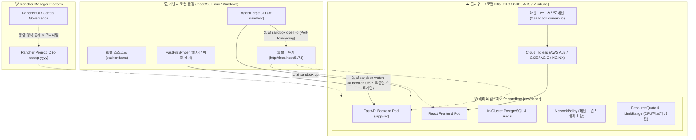
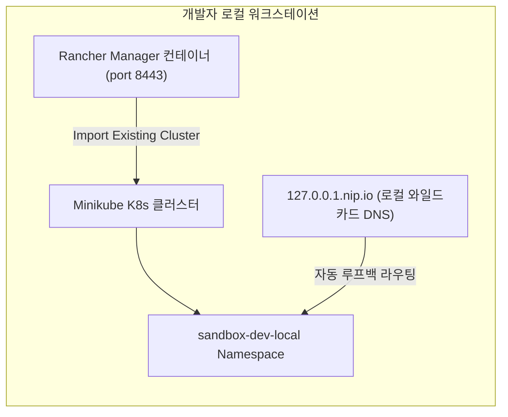

> [🏠 README](../README.md) &nbsp;|&nbsp; [⚡ Quickstart](quickstart.md) &nbsp;|&nbsp; [⚙️ CLI & Scaffolding](cli.md) &nbsp;|&nbsp; [🏗️ Architecture](architecture.md) &nbsp;|&nbsp; [🛠️ AI Skills](skills.md) &nbsp;|&nbsp; [🐳 Infrastructure](infrastructure.md) &nbsp;|&nbsp; **[🏖️ Sandbox](sandbox.md)** &nbsp;|&nbsp; [🌱 Env Variables](env-vars.md)

---

# 🏖️ 온디맨드 멀티 CSP 개발자 샌드박스 가이드 (`af sandbox`)

AgentForge는 **AWS EKS, GCP GKE, Azure AKS** 등 멀티 클라우드 쿠버네티스 환경과 **Rancher(https://github.com/rancher/rancher)** 관리 체계를 연동하여, 개발자마다 독립된 클라우드 샌드박스 환경을 10초 만에 프로비저닝하고 로컬 소스코드를 무중단 실시간 동기화할 수 있는 **온디맨드 개발자 샌드박스 (`af sandbox`)** 기능을 제공합니다.

---

## 1. 샌드박스 아키텍처 및 동작 원리



---

## 2. AgentForge 생성 프로젝트 내 실전 사용법 (In-Project Usage)

`af new my-agent`로 생성된 프로젝트 루트 디렉토리에서 아래 명령어들을 즉시 실행할 수 있습니다.

> 💡 **전역 CLI 미설치 시 `./af` 래퍼 스크립트 활용 (Zero-Install)**:
> 생성된 프로젝트 루트에는 `./af` (macOS/Linux) 및 `af.bat` (Windows) 실행 래퍼가 기본 포함되어 있습니다. 개발자 PC에 `agentforge`가 전역 설치되어 있지 않더라도, `./af sandbox ...` 명령을 실행하면 `uvx`를 통해 별도 설치 없이 즉시 실행됩니다. (전역 CLI 설치 시에는 `af sandbox ...`로 단축 실행 가능)

### 1) 샌드박스 원클릭 프로비저닝 (`af sandbox up` 또는 `./af sandbox up`)

개발자 이름에 기반한 독립 네임스페이스(`sandbox-<user>`), ResourceQuota, NetworkPolicy 거버넌스와 함께 프로젝트의 Kubernetes 워크로드(Backend, Frontend, ConfigMap, Ingress)를 원클릭으로 클러스터에 배포합니다 (RFC 1123 규격 자동 변환 지원):

```bash
# 기본 AWS EKS 환경에 8시간 TTL로 샌드박스 생성 (래퍼 스크립트 사용)
./af sandbox up

# 전역 CLI가 설치된 경우 단축 실행
af sandbox up

# 대상 클라우드 CSP 명시 (AWS EKS, GCP GKE, Azure AKS)
af sandbox up --csp aws --name alice --ttl 8h
af sandbox up --csp gcp --name bob --ttl 4h
af sandbox up --csp azure --name charlie --ttl 24h

# 생성 전 매니페스트 미리보기 (Dry-Run)
af sandbox up --csp aws --name alice --dry-run

# 사설 RDS/CloudSQL 공유 DB 대신 클러스터 내 임베디드 격리 DB 사용
af sandbox up --shared-db=false

# Rancher Project와 연동하여 중앙 거버넌스 적용
af sandbox up --rancher-project c-m-xxxx:p-yyyy

# 프로비저닝 완료 즉시 실시간 코드 와처 자동 시작
af sandbox up --watch
```

#### 주요 옵션 플래그
| 플래그 | 단축키 | 기본값 | 설명 |
| :--- | :--- | :--- | :--- |
| `--csp` | `-c` | `aws` | 타겟 클라우드 제공자 (`aws`, `gcp`, `azure`) |
| `--name` | `-n` | 현재 OS 사용자 | 샌드박스 고유 식별자 (`sandbox-{name}` 네임스페이스 생성) |
| `--ttl` | `-t` | `8h` | 샌드박스 유효 기간 (`30m`, `4h`, `8h`, `24h`, `2d`) |
| `--domain` | `-d` | `sandbox.agentforge.io` | 와일드카드 서브도메인 베이스 URL |
| `--shared-db` | - | `false` | 중앙 공유 DB 사용 여부 (`false` 시 파드 내부 격리 DB 기동) |
| `--rancher-project` | `-p` | `None` | 바인딩할 Rancher Project ID |
| `--dry-run` | - | `false` | 클러스터에 적용하지 않고 YAML 매니페스트만 화면 출력 |
| `--watch` | `-w` | `false` | 생성 완료 즉시 소스코드 변경 감지 스트리밍 시작 |

---

### 2) 실시간 무중단 핫리로드 동기화 (`af sandbox watch`)

로컬 파일시스템의 소스코드 변경을 감지하여 원격 샌드박스 Pod(`/app/src`)로 **0.5초 내에 직접 스트리밍 동기화**합니다:

```bash
af sandbox watch
```
- **빌드/재배포 생략**: Docker 이미지 빌드나 Helm 배포 없이 원격 컨테이너 내부로 파일이 복사되며, Uvicorn 및 Vite의 HMR(Hot Module Replacement)에 의해 즉시 반영됩니다.
- **불필요한 파일 자동 필터링**: `.pyc`, `__pycache__`, `.git` 등 임시 파일은 자동으로 제외되어 네트워크 대역폭을 낭비하지 않습니다.

---

### 3) 샌드박스 웹 접속 및 로컬 터널링 (`af sandbox open`)

```bash
# 1. 와일드카드 도메인을 통해 웹 브라우저로 원격 샌드박스 열기
af sandbox open
# -> https://alice.sandbox.agentforge.io 접속

# 2. 로컬 포트포워딩 터널링 모드 (외부 DNS 없이 즉시 디버깅)
af sandbox open --port-forward
# -> Frontend: http://localhost:5173
# -> Backend API: http://localhost:8000
```

---

### 4) 유휴 절전 및 비용 0원화 (`af sandbox pause` / `resume`)

점심시간, 퇴근 후, 또는 회의 중에는 컴퓨팅 리소스를 0으로 축소하여 **클라우드 비용을 획기적으로 절감**할 수 있습니다:

```bash
# 1. 절전 모드 (Replicas=0 축소, 클라우드 CPU/메모리 비용 0원)
af sandbox pause

# 2. 작업 재개 (Replicas=1 복구)
af sandbox resume
```

---

### 5) 헬스체크 및 샌드박스 완전 회수 (`af sandbox status` / `down`)

```bash
# 샌드박스 파드 상태 및 남은 TTL 확인
af sandbox status

# 샌드박스 네임스페이스 및 모든 리소스 안전 삭제 (확인 프롬프트)
af sandbox down

# 프롬프트 없이 강제 즉시 삭제
af sandbox down --force
```

---

## 3. 🧪 클라우드 비용 0원! 로컬 환경에서의 Rancher 기반 검증 가이드

클라우드 계정이나 추가 요금 없이, 개인 개발 PC(`Docker` + `Minikube`)에서 Rancher 컨테이너와 `af sandbox` 기능을 100% 동일하게 검증할 수 있습니다:



### 1단계: Minikube 및 Rancher Server 기동
```bash
# 1. Minikube 기동 (CPU 4, 메모리 8GB 권장)
minikube start --cpus=4 --memory=8192

# 2. Rancher 단일 노드 매니저 컨테이너 실행
docker run -d --restart=unless-stopped \
  -p 8080:80 -p 8443:443 \
  --privileged \
  --name rancher-local \
  rancher/rancher:latest
```

### 2단계: Rancher에 Minikube 클러스터 연동 (Import)
1. 브라우저로 `https://localhost:8443` 접속
   > 💡 **Rancher 웹 접속 팁 & 트러블슈팅**:
   > - **초기 부팅 대기**: 컨테이너 내부의 K3s 클러스터 및 etcd 초기화로 인해 `docker run` 후 약 **1~2분간** 접속이 지연될 수 있습니다.
   > - **SSL 인증서 경고 우회**: 자체 서명 사설 인증서를 사용하므로 Chrome/Edge의 경우 **[고급]** ➔ **[localhost(안전하지 않음)(으)로 이동]**을 클릭합니다. (HSTS로 이동 링크가 뜨지 않으면 화면 빈 곳 클릭 후 **`thisisunsafe`** 타이핑)
   > - **초기 부트스트랩 비밀번호 확인**: 초기 로그인 시 요구되는 Bootstrap Password는 아래 명령어로 확인합니다:
   >   ```bash
   >   docker logs rancher-local 2>&1 | grep "Bootstrap Password:"
   >   ```
   > - **포트 및 프로토콜**: 반드시 `https://localhost:8443`을 입력하거나, 80포트로 매핑된 `http://localhost:8080`(자동 HTTPS 리다이렉트)으로 접속하세요.
2. 초기 관리자 비밀번호 입력 후 새 비밀번호를 **`admin1234!@#$`**로 설정하고 로그인
3. **Cluster Management** ➔ **Import Existing** 선택
4. 클러스터 이름을 `local-minikube`로 지정 후 생성
5. 화면에 제공되는 `curl ... | kubectl apply -f -` 등록 명령어를 로컬 터미널에서 실행하여 연동 완료

### 3단계: 로컬 샌드박스 프로비저닝 & 테스트
```bash
# 1. 127.0.0.1.nip.io 와일드카드 DNS를 이용한 샌드박스 생성 (외부 DNS 설정 불필요)
af sandbox up --name dev-local --domain 127.0.0.1.nip.io --ttl 4h

# 2. 로컬 코드 실시간 핫리로드 시작
af sandbox watch

# 3. 로컬 포트포워딩으로 앱 접속
af sandbox open --port-forward

# 4. 절전 및 회수 테스트
af sandbox pause
af sandbox resume
af sandbox down --force
```

---

## 4. 다중 CSP 인프라 매트릭스 (CSP Support Matrix)

| 클라우드 제공자 | Workload Identity / IRSA | Ingress 컨트롤러 | 기본 StorageClass | DNS 가이드 |
| :--- | :--- | :--- | :--- | :--- |
| **AWS EKS** | `eks.amazonaws.com/role-arn` | AWS Load Balancer (ALB) | `gp3` | Route53 Wildcard Alias |
| **GCP GKE** | `iam.gke.io/gcp-service-account` | GKE Ingress (GCE) | `standard-rwo` | Cloud DNS Wildcard A Record |
| **Azure AKS** | `azure.workload.identity/client-id` | Application Gateway (AGIC) | `managed-csi` | Azure DNS Wildcard CNAME/A |
| **Local Minikube** | ServiceAccount Local Token | NGINX Ingress | `standard` | `*.nip.io` Wildcard Loopback |

---

## 5. 보안 및 안전 거버넌스 (Security & Governance)

1. **완벽한 테넌트 격리 (`NetworkPolicy`)**:
   - 동일 샌드박스 네임스페이스 내부(`Backend <-> DB <-> Redis`) 통신 및 공용 Ingress 트래픽만 인바운드를 허용합니다.
   - 다른 개발자의 `sandbox-*` 네임스페이스로의 임의 트래픽은 CNI 계층에서 원천 차단됩니다.
2. **리소스 남용 방지 (`ResourceQuota` & `LimitRange`)**:
   - 각 개발자 샌드박스는 최대 CPU 4Core, 메모리 8Gi, 파드 15개로 상한이 제약되어 단일 개발자의 실수가 전체 노드 고갈로 이어지지 않습니다.
3. **TTL 기반 자동 만료 회수**:
   - 네임스페이스에 `agentforge.io/expires-at` 어노테이션이 기록되며, 만료된 샌드박스는 자동으로 회수되어 방치된 리소스로 인한 클라우드 과금을 방지합니다.

---

> [🏠 README](../README.md) &nbsp;|&nbsp; [⚡ Quickstart](quickstart.md) &nbsp;|&nbsp; [⚙️ CLI & Scaffolding](cli.md) &nbsp;|&nbsp; [🏗️ Architecture](architecture.md) &nbsp;|&nbsp; [🛠️ AI Skills](skills.md) &nbsp;|&nbsp; [🐳 Infrastructure](infrastructure.md) &nbsp;|&nbsp; **[🏖️ Sandbox](sandbox.md)** &nbsp;|&nbsp; [🌱 Env Variables](env-vars.md)
