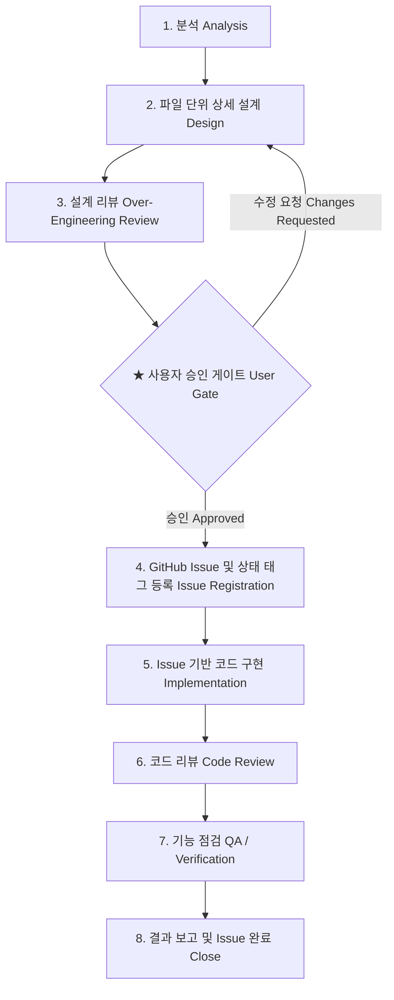

# 🛠️ AI 개발 하네스 완전 가이드 (AI Developer Harness Skills)

> [🏠 README](../README.md) &nbsp;|&nbsp; [⚡ Quickstart](quickstart.md) &nbsp;|&nbsp; [⚙️ CLI & Scaffolding](cli.md) &nbsp;|&nbsp; [🏗️ Architecture](architecture.md) &nbsp;|&nbsp; **[🛠️ AI Skills](skills.md)** &nbsp;|&nbsp; [🐳 Infrastructure](infrastructure.md) &nbsp;|&nbsp; [🌱 Env Variables](env-vars.md)

---

AgentForge로 생성된 모든 프로젝트는 AI 코딩 에이전트(Google Antigravity, Claude Code, Cursor, Windsurf 등)와의 협업 과정에서 발생하는 **환각 코딩, 아키텍처 파괴, 과도한 재작성, 테스트 없는 수정**을 원천 차단하기 위해 **`.agents/skills/` 기반의 표준 개발 하네스**를 기본 탑재하고 있습니다.

---

## 1. 왜 개발 하네스인가요? (통제되지 않는 AI 코딩 방지)

AI 코딩 어시스턴트에게 단순 프롬프트로 지시를 내리면 다음과 같은 치명적인 문제가 자주 발생합니다:
- **무계획적 파일 수정**: 파일 수십 개를 임의로 건드려 기존 정상 동작 코드를 파손
- **아키텍처 경계 왜곡**: 단순 유틸리티를 위해 불필요하게 5~6개 레이어와 과도한 제네릭/디자인 패턴을 남용 (Over-Engineering)
- **증명 없는 버그 수정**: 버그를 재현하는 테스트 없이 짐작으로 코드를 수정하여 잠재적 회귀 결함을 유발

AgentForge 개발 하네스는 **엄격한 8단계 엔지니어링 파이프라인**을 통해 AI의 행동을 완전히 규격화합니다:

| 구분 | 통제되지 않는 기존 코딩 | ✨ **AgentForge 개발 하네스** |
| :--- | :--- | :--- |
| **요구사항 분석** | 지시 즉시 코드부터 작성 | 도메인 규칙 및 파급 영향도(Blast Radius) 사전 분석 |
| **설계 구체성** | 모호한 계획 또는 즉흥 수정 | `[NEW]`, `[MODIFY]`, `[DELETE]` **파일 단위 상세 명세** 작성 |
| **설계 리뷰** | 없음 (과도한 복잡도 양산) | **YAGNI & 과도한 재작성 방지 4대 원칙** 자체 리뷰 |
| **작업 승인** | AI 자의적 일괄 진행 | **★ 사용자 승인 게이트(Human-in-the-loop)** 통과 필수 |
| **이슈 추적** | 추적 불가 | GitHub Issue 자동 등록 및 단계별 라벨 전이 (Transition) |
| **버그 수정** | 짐작 코딩 | **실패하는 재현 테스트(RED) 필수 선작성** 후 통과(GREEN) |
| **검증 및 보고** | "수정했습니다" 끝 | 자동화/신규 테스트 통과 증명 + 수동 검증 체크리스트 보고 |

---

## 2. 3개 특화 개발 하네스 스킬

AgentForge는 작업 성격에 맞춰 최적화된 3가지 특화 스킬을 제공합니다:

```text
.agents/skills/
├── feature-development/SKILL.md   # 신규 기능 개발
├── feature-enhancement/SKILL.md   # 기존 기능 개선 / 리팩토링
├── bugfix/SKILL.md                # 결함 추적 및 버그 수정
└── shared/workflow-spec.md        # 공통 8단계 규약 및 GitHub 라벨 체계
```

| 스킬명 | 적용 작업 유형 | 핵심 차별화 엔지니어링 규칙 |
| :--- | :--- | :--- |
| **`feature-development`** | **신규 기능 개발** | Clean Architecture 계층 분리, 파일 단위 `[NEW]`/`[MODIFY]` 구체적 설계, 신규 단위/E2E 테스트 케이스 필수 작성 |
| **`feature-enhancement`** | **기능 개선 / 리팩토링** | 파급 영향도(Blast Radius) 분석, 하위 호환성(Breaking Changes) 점검, 과도한 재작성(Over-refactoring) 방지 |
| **`bugfix`** | **버그 / 장애 수정** | 근본 원인(RCA) 분석, **재현 실패 테스트(Reproducing Test) 선작성 필수**, 최소 수정 원칙(Minimal Diff) 엄수 |

---

## 3. 8단계 표준 워크플로우 파이프라인

모든 하네스 스킬은 아래 8단계 파이프라인을 엄격히 준수합니다:



### 단계별 상세 가이드

1. **[1단계] 분석 (Analysis)**: 사용자 요구사항의 핵심 목표 파악, 도메인 경계 정의 및 기존 시스템과의 데이터 계약 분석.
2. **[2단계] 파일 단위 상세 설계 (Design)**:
   - `[NEW] path/to/file`: 신규 파일의 책임, 주요 함수 시그니처 및 타입 명시
   - `[MODIFY] path/to/file`: 수정 대상 함수/라인 블록, 변경 로직 및 영향도
   - `[DELETE] path/to/file`: 제거 대상 및 대체 방안
3. **[3단계] 설계 리뷰 (Over-engineering Check)**:
   - **YAGNI**: 현재 필요 없는 미래 대비 인터페이스/파라미터 제거
   - **과도한 추상화 방지**: 단 한 번만 쓰이는 팩토리, 데코레이터, 제네릭 제거
   - **최소 변경 원칙 (Minimal Diff)**: 기존 코드와 패턴을 최대한 재사용
4. **[★ 사용자 승인 게이트 (Human-in-the-loop Gate)]**:
   - 에이전트는 설계를 임의로 확정하고 구현을 시작하지 않습니다.
   - 설계서와 오버엔지니어링 검토 결과를 사용자에게 보고하고, **명시적 승인(`Proceed` 또는 확인)**을 획득해야 4단계로 진입합니다.
5. **[4단계] GitHub Issue & 태그 등록**:
   - GitHub CLI(`gh`)를 통해 공식 Issue를 생성하고 라벨(`type:*`, `stage:implementation`, `status:in-progress`)을 부착합니다.
   - `gh` 미인증 환경에서는 프로젝트 내 `.github/issues/` 로컬 마크다운 파일로 자동 폴백합니다.
6. **[5단계] Issue 기반 구현**:
   - 승인된 파일 단위 설계서 범위를 벗어나지 않고 정밀하게 코드 작성.
7. **[6단계] 코드 리뷰**:
   - `git diff`를 실행하여 의도치 않은 사이드 이펙트, 보안 취약점, 미사용 주석 잔재를 점검하고 이슈 댓글로 남깁니다.
8. **[7단계] 기능 점검 (QA & Testing)**:
   - 자동화 테스트 실행 (`uv run pytest tests/`, 프론트엔드 빌드)
   - 신규/회귀 테스트 케이스 작성 및 통과 증명
   - cURL/브라우저 수동 검증 체크리스트 생성
9. **[8단계] 결과 보고 및 Issue 완료**:
   - GitHub Issue 태그를 `stage:done`, `status:completed`로 전환하고 요약과 함께 이슈 Close.

---

## 4. GitHub Issue & 단계별·상태별 태그(Label) 체계

작업 진행 상황을 투명하게 관리하기 위해 단일 이슈 내에서 라벨을 유기적으로 전환합니다:

| 카테고리 | 태그 (Label) | 색상 권장 | 설명 및 전이 규칙 |
| :--- | :--- | :--- | :--- |
| **유형 (Type)** | `type:feature` | `#0E8A16` (Green) | 신규 기능 개발 (생성 시 1회 고정) |
| | `type:enhancement` | `#1D76DB` (Blue) | 기존 기능 개선/리팩토링 (생성 시 1회 고정) |
| | `type:bugfix` | `#D93F0B` (Red) | 결함 및 버그 수정 (생성 시 1회 고정) |
| **단계 (Stage)** | `stage:analysis` | `#FBCA04` (Yellow) | 요구사항 및 영향도 분석 중 |
| *(단일 유지)* | `stage:design` | `#FBCA04` (Yellow) | 파일 단위 상세 설계 중 |
| | `stage:design-review` | `#FEF2C0` (Light Yellow) | 오버엔지니어링 검토 및 승인 대기 |
| | `stage:implementation` | `#5319E7` (Purple) | 코드 구현 진행 중 |
| | `stage:code-review` | `#006B75` (Teal) | 코드 리뷰 진행 중 |
| | `stage:qa-testing` | `#BFDADC` (Cyan) | 자동화/수동 기능 점검 중 |
| | `stage:done` | `#0E8A16` (Green) | 최종 완료 |
| **상태 (Status)** | `status:in-progress` | `#C2E0C6` (Light Green) | 정상 진행 중 |
| | `status:blocked` | `#B60205` (Dark Red) | 피드백 대기 또는 차단 |
| | `status:completed` | `#0E8A16` (Green) | 성공적으로 완료됨 |

> 🔄 **라벨 전이 규칙**: `stage:*` 태그는 작업 단계가 전진할 때마다 이전 라벨을 제거하고 현재 단계 라벨 하나만 유지합니다.

---

## 5. Zero-Prompt 자동화 및 AI 에이전트 실전 활용 가이드

AgentForge의 개발 하네스는 **"사용자가 매번 번거롭게 파일 경로나 복잡한 지시문을 입력할 필요가 없다"**는 대원칙으로 설계되었습니다.

프로젝트 루트에 기본 탑재된 에이전트 브릿지 설정(`AGENTS.md`, `CLAUDE.md`, `.cursorrules`)과 `.agents/skills/` 표준 규약에 따라, 에이전트는 사용자의 자연어 의도를 스스로 파악하고 적합한 하네스를 100% 자동 구동합니다.

---

### 1) 사용자 자연어 요청 예시 (Zero-Prompt)

사용자는 일반적인 개발 요청을 하듯이 자연스럽게 지시하면 됩니다. 에이전트가 알아서 해당 하네스를 발동합니다:

| 작업 유형 | 사용자 프롬프트 (단 한 줄의 자연어) | 에이전트 자동 동작 흐름 |
| :--- | :--- | :--- |
| **신규 기능 추가** | *"대화 세션을 JSON으로 내보내는 '대화 내보내기' 기능 추가해줘."* | `feature-development` 자동 활성화 → Clean Architecture 경계 및 `[NEW]`/`[MODIFY]` 파일 단위 상세 설계 작성 → 오버엔지니어링 검토 후 **사용자 승인 게이트 대기** |
| **기존 기능 개선** | *"Redis 세션 스토리지의 TTL 자동 갱신 로직을 개선해줘."* | `feature-enhancement` 자동 활성화 → 파급 영향도 분석 & 하위 호환성 점검 → 과도한 재작성 방지 설계 후 **사용자 승인 게이트 대기** |
| **결함 및 버그 수정** | *"토큰 스트리밍 도중 클라이언트 연결 끊김 시 500 에러 고쳐줘."* | `bugfix` 자동 활성화 → RCA 근본 원인 규명 → **실패하는 재현 테스트(RED) 선작성 계획** 수립 후 **사용자 승인 게이트 대기** |

> 💡 **사용자 승인 게이트**: 어떤 에이전트를 사용하든 에이전트는 코드를 임의로 고치지 않고, 반드시 3단계 설계 리뷰 후 사용자에게 **"설계를 검토하고 승인해 주세요(Proceed)"** 관문을 거칩니다.

---

### 2) 도구별 Zero-Configuration 자동 인식 원리

어떤 AI 코딩 도구를 사용하더라도 별도 설정 없이 즉시 동작하도록 4대 에이전트 진입점이 기본 구성되어 있습니다:

| AI 코딩 도구 | 자동 인식 파일 | 에이전트 내부 동작 방식 |
| :--- | :--- | :--- |
| **Google Antigravity** | `.agents/skills/` | 프로젝트 로딩 시 3개 스킬(`feature-development`, `feature-enhancement`, `bugfix`)을 네이티브 Tool/Skill로 자동 등록하여 자연어 의도에 맞춰 즉시 호출 |
| **Anthropic Claude Code** | `CLAUDE.md` & `AGENTS.md` | 세션 시작 시 `CLAUDE.md`를 자동 파싱하여 개발 하네스 규칙 및 8단계 파이프라인 지침을 시스템 컨텍스트로 상시 유지 |
| **Cursor / Windsurf** | `.cursorrules` & `AGENTS.md` | IDE에서 프롬프트 작성 시 `.cursorrules`를 자동 주입하여 파일 단위 설계 및 승인 게이트 규칙 강제 준수 |
| **OpenAI Codex / Copilot** | `AGENTS.md` | 리포지토리 루트의 `AGENTS.md`를 단일 진실 공급원(SSOT)으로 자동 인식하여 일관된 하네스 워크플로우 적용 |

---

> [🏠 README](../README.md) &nbsp;|&nbsp; [⚡ Quickstart](quickstart.md) &nbsp;|&nbsp; [⚙️ CLI & Scaffolding](cli.md) &nbsp;|&nbsp; [🏗️ Architecture](architecture.md) &nbsp;|&nbsp; **[🛠️ AI Skills](skills.md)** &nbsp;|&nbsp; [🐳 Infrastructure](infrastructure.md) &nbsp;|&nbsp; [🌱 Env Variables](env-vars.md)
